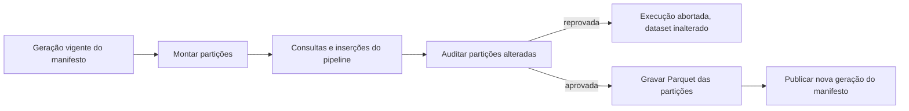

# Plano de implementação do serialize-db

Este documento reúne boas práticas de ETL pesquisadas em 2026-09-12 e as sugestões de implementação
derivadas delas. As primeiras seções tratam do Redshift, do formato Parquet e da evolução de esquema.
As seções finais tratam do suporte ao DuckDB e do uso do SQLAlchemy nas consultas. As fontes estão no
fim do documento e em [REFERENCES.md](../REFERENCES.md).

## Resumo das recomendações

1. O dataset Parquet continua sendo a fonte da verdade do histórico (opção 1), com duas mudanças: um
   manifesto versionado define quais arquivos compõem cada partição, e o banco deixa de ser
   reconstruído por inteiro. Cada execução monta apenas as partições que o pipeline lê.
2. Toda escrita passa pela biblioteca, que registra as partições alteradas. A exportação incremental
   grava essas partições, audita os dados e publica uma nova geração do manifesto. Reexecutar uma data
   substitui a partição em vez de duplicá-la.
3. Os modelos ORM continuam como fonte única do esquema. A biblioteca gera o DDL de cada backend a
   partir deles e aplica uma política de restrições por backend. O desempenho não exige DDL escrito à
   mão.
4. O Apache Arrow é o formato de troca em memória. O esquema Arrow deriva dos modelos e valida os dados
   antes de qualquer gravação.
5. No Redshift, a inserção grava Parquet no S3 e executa `COPY` para uma tabela de staging. A exportação
   usa um `UNLOAD` por partição. O `INSERT` com várias linhas fica restrito a volumes pequenos.
6. No DuckDB, a montagem lê os arquivos do manifesto sem importação, e a inserção consome tabelas Arrow
   diretamente.
7. O SQLAlchemy compila as consultas com o dialeto do backend (`duckdb-engine` ou
   `sqlalchemy-redshift`). A biblioteca executa a consulta e devolve uma tabela Arrow.
8. Tabelas Apache Iceberg substituem o manifesto próprio quando houver um catálogo (AWS Glue Data
   Catalog ou S3 Tables). Redshift e DuckDB já leem e escrevem Iceberg; a adoção depende de uma prova de
   conceito.

## Custo da reconstrução atual

A reconstrução atual leva cerca de 7 horas antes de o pipeline começar. O custo tem duas causas:

- A ingestão no PostgreSQL é lenta. Com DuckDB e Redshift, a equipe mediu a ingestão da base inteira em
  poucos minutos.
- O protocolo reconstrói a base inteira, embora o pipeline dependa de poucas partições.

Trocar o banco resolve a primeira causa. A segunda exige mudar o protocolo: carregar só o que o
pipeline lê, ou consultar os arquivos Parquet no lugar. Esta proposta trata das duas.

## Boas práticas de ETL aplicáveis

### Partições imutáveis e substituição idempotente

A partição (por exemplo, a data de referência) é a unidade de escrita. Uma correção ou reexecução
grava a partição inteira de novo e substitui a anterior. Reexecuções ficam idempotentes, e a
exportação incremental se reduz a gravar as partições alteradas.

### Write-Audit-Publish

Os dados novos são gravados numa área invisível aos leitores, auditados (contagem de linhas, nulos,
unicidade de chaves, limites de tipo) e só então publicados. Uma auditoria reprovada interrompe a
execução sem alterar o dataset publicado.

### Manifesto como ponto de commit

O S3 não renomeia diretórios de forma atômica. Listar um prefixo mistura arquivos antigos, novos e
parciais. O manifesto lista os arquivos válidos, e os leitores usam apenas essa lista. Publicar é criar
uma nova geração do manifesto. No S3, a escrita condicional impede que dois processos criem a mesma
geração; no disco local, `os.replace` é atômico.

### Contrato de esquema

O esquema vive num único lugar, os modelos ORM, e dele derivam o DDL, o esquema Arrow, o esquema
gravado no manifesto e as auditorias. O [etl-cookbook-tutorial](https://github.com/felipenoris/etl-cookbook-tutorial)
chama esse uso de "modelos como contrato".

## Redshift

### Carga com COPY

A documentação do Redshift recomenda `COPY` para cargas, `INSERT` com várias linhas apenas quando
`COPY` não é possível, e inserção em bloco a partir de tabelas de staging. O `INSERT` grande da
biblioteca atual vira este fluxo:

1. Converter o DataFrame numa tabela Arrow com o esquema do modelo (cast seguro).
2. Gravar Parquet em `s3://<bucket>/<prefixo>/staging/<id_execucao>/<tabela>/`.
3. `CREATE TEMP TABLE stg (LIKE <tabela>)`.
4. `COPY stg FROM '<prefixo ou manifesto>' IAM_ROLE '<arn>' FORMAT AS PARQUET`.
5. Comparar `pg_last_copy_count()` com o número de linhas enviadas.
6. Na mesma transação, `DELETE` das partições substituídas e `INSERT INTO <tabela> SELECT ... FROM stg`.

O passo 6 segue o "merge method 1" da documentação, o mais rápido quando linhas inteiras são
substituídas. O comando `MERGE` atende atualizações parciais.

Implementações existentes servem de referência ou dependência:

- `awswrangler.redshift.copy` (versão 3.17.1, 2026-08-03) executa o mesmo fluxo, com os modos `append`,
  `overwrite` e `upsert`.
- O driver ADBC para Redshift (versão 1.7.0, 2026-09-09) faz ingestão em bloco e leitura em Arrow. Ele
  merece um benchmark contra o fluxo acima.

### Regras do COPY para Parquet

| Regra da documentação | Consequência para a biblioteca |
| --- | --- |
| Colunas são associadas por posição, e a quantidade precisa coincidir com a tabela. | A ordem das colunas no Parquet é a ordem do modelo. Os dois derivam do mesmo `Table`. |
| Só existem as colunas gravadas no arquivo. | Colunas de partição ficam dentro do arquivo, não só no caminho `coluna=valor/`. |
| Parâmetros aceitos: `ACCEPTINVCHARS`, `FILLRECORD`, `FROM`, `IAM_ROLE`, `CREDENTIALS`, `STATUPDATE`, `MANIFEST`, `EXPLICIT_IDS`. `MAXERROR` não é aceito. | O primeiro erro aborta o `COPY`. A validação acontece antes, no Arrow. |
| `MANIFEST` é aceito. | O `COPY` carrega exatamente os arquivos listados no manifesto do dataset. |
| O bucket precisa estar na mesma região do Redshift. | Configuração da infraestrutura. |
| O `COPY` de Parquet usa URLs pré-assinadas válidas por 1 hora. | Políticas IAM do bucket não podem bloquear URLs pré-assinadas. |

### Exportação com UNLOAD

Comportamento do `UNLOAD ... FORMAT AS PARQUET` segundo a documentação:

- Cada row group é comprimido com SNAPPY. O row group padrão tem 32 MB; `ROWGROUPSIZE` aceita de 32 MB
  a 128 MB em alguns tipos de nó.
- `MAXFILESIZE` aceita de 5 MB a 6,2 GB (padrão 6,2 GB) e é arredondado para baixo até um múltiplo de
  32 MB.
- Com `PARTITION BY`, as colunas de partição saem dos arquivos, exceto com `INCLUDE`.
- `CLEANPATH` apaga de forma permanente os arquivos das pastas de partição que recebem dados novos.
- Colunas `TIMESTAMPTZ` perdem a informação de fuso horário.
- O `SELECT` externo não aceita `LIMIT`.
- O Redshift Spectrum ignora arquivos cujo nome começa com `_` ou `.`.
- `MANIFEST VERBOSE` lista os arquivos, os nomes e tipos das colunas e as linhas por arquivo.
- Colunas `VARBYTE`, `GEOMETRY` e `HLLSKETCH` só saem em texto ou CSV.

Sugestão: um `UNLOAD` por partição, sem `PARTITION BY`, com destino
`<raiz>/<tabela>/<coluna>=<valor>/<id_execucao>_` e `MANIFEST VERBOSE`. O `SELECT` lista as colunas na
ordem do modelo, com casts explícitos e `ORDER BY` pela chave de ordenação da tabela. A biblioteca lê o
manifesto do `UNLOAD`, compara tipos e contagens com o contrato e publica a nova geração do manifesto
do dataset. `CLEANPATH` não é usado: arquivos substituídos saem na coleta de lixo, depois da
publicação.

### Restrições

Unicidade, chave primária e chave estrangeira são informativas no Redshift. O planejador usa essas
chaves para decorrelacionar subconsultas, ordenar e eliminar joins, e supõe que elas são válidas. Com
chaves inválidas, consultas retornam resultados errados; a documentação cita um `SELECT DISTINCT` que
devolve duplicatas. `NOT NULL` é aplicado.

Sugestão: declarar `PRIMARY KEY` e `FOREIGN KEY` apenas nas tabelas cujas chaves a etapa de auditoria
verifica, e declarar `NOT NULL` sempre.

### Tipos de dados

- `TEXT` vira `VARCHAR(256)`, e `VARCHAR` sem tamanho também tem 256 bytes.
- O tamanho de `VARCHAR` é medido em bytes; um caractere UTF-8 ocupa até 4 bytes. O máximo é 65535
  bytes.
- A documentação recomenda o menor tamanho de coluna que comporte os dados.
- O DuckDB não aplica o tamanho de `VARCHAR(n)`. Dados aceitos no DuckDB podem estourar o limite no
  Redshift.

Sugestão: exigir `String(n)` nos modelos das tabelas exportadas para o Redshift. `Text` vira
`VARCHAR(65535)` com aviso. A auditoria mede o tamanho em bytes com `pyarrow.compute.binary_length`
antes do `COPY`.

### Migrações de esquema no Redshift

Limites do `ALTER TABLE` relevantes para migrações:

- `ALTER COLUMN ... TYPE` só aumenta o tamanho de `VARCHAR`. Não roda dentro de transação nem em
  colunas com valor padrão, `UNIQUE`, `PRIMARY KEY` ou `FOREIGN KEY`.
- `ADD COLUMN` adiciona uma coluna por comando e não cria `UNIQUE`, `PRIMARY KEY`, `FOREIGN KEY` nem
  `IDENTITY`.
- Colunas de `DISTKEY` ou `SORTKEY` não podem ser adicionadas nem removidas.
- `ALTER TABLE` em tabela externa e `CREATE EXTERNAL TABLE` não rodam dentro de transação.

Outras mudanças de tipo exigem cópia profunda: criar a tabela nova, `INSERT ... SELECT` com cast e
trocar os nomes. No Alembic, isso pede `transaction_per_migration=True` e
`op.get_context().autocommit_block()` nos comandos não transacionais. Na opção 1, com banco efêmero,
esses limites só afetam backends persistentes; o dataset evolui pelo mecanismo descrito em
[Evolução de esquema](#evolução-de-esquema).

### Leitura sem carga com Redshift Spectrum

O Spectrum consulta Parquet no S3 por meio de tabelas externas:

- O esquema externo aponta para o AWS Glue Data Catalog, o Athena ou um Hive metastore.
- Partições são registradas com `ALTER TABLE ... ADD PARTITION`, até 100 por comando com o Glue. O
  local de uma partição pode ser uma pasta ou um arquivo de manifesto.
- Views sobre tabelas externas exigem `WITH NO SCHEMA BINDING`.
- O Redshift não coleta estatísticas de tabelas externas; a propriedade `numRows` informa o tamanho ao
  planejador.
- Uma coluna de partição da tabela externa não pode ter o nome de uma coluna da tabela.

Sugestão: usar tabelas externas para tabelas grandes que o pipeline só lê, apontando cada partição
para um manifesto gerado pela biblioteca. A viabilidade depende de haver Glue Data Catalog, e o
desempenho precisa ser comparado com o `COPY` seletivo. Os arquivos do dataset contêm as colunas de
partição, então a avaliação também decide entre tabela externa particionada e tabela externa sem
`PARTITIONED BY` apontando para um manifesto com os arquivos do filtro.

### Tabelas Iceberg no Redshift

O suporte do Redshift a Iceberg evoluiu assim:

| Data | Recurso |
| --- | --- |
| 2025-11-17 | Escrita GA: `CREATE TABLE ... USING ICEBERG`, `INSERT`, `CREATE TABLE AS SELECT`. |
| 2026-04-23 | `UPDATE`, `DELETE` e `MERGE` em tabelas particionadas ou não, incluindo S3 Tables. |
| 2026-05-18 | `ALTER TABLE` (adicionar, remover e renomear colunas, alargar tipos, evoluir partições) e escrita pelo catálogo `awsdatacatalog` montado automaticamente. |
| agosto de 2026 | Iceberg v3, com valores padrão de coluna sem reescrita de dados. |

Detalhes da documentação:

- Catálogos: AWS Glue Data Catalog e S3 Tables.
- `ADD COLUMN` só altera metadados; linhas existentes recebem `NULL`, ou o valor padrão em tabelas v3.
- Alargamentos permitidos: `int` para `bigint`, `float` para `double`, `decimal(P, S)` para
  `decimal(P2, S)` com `P2 > P`.
- `DELETE ... WHERE <coluna de partição> = <valor>` remove a partição só nos metadados.
- Tabelas Iceberg não aceitam restrições de coluna.

Para este projeto, Iceberg entrega de forma padronizada o que o manifesto próprio entrega: commit
atômico, snapshots e evolução aditiva sem reescrita. O custo é depender de um catálogo e perder as
chaves informativas, a `SORTKEY` e a `DISTKEY` das tabelas nativas.

## Formato do dataset Parquet

### Layout de diretórios

```text
<raiz>/
  _serialize_db/
    manifestos/000042.json
    esquemas/<revisao_alembic>.json
  <tabela>/
    <coluna_particao>=<valor>/
      <id_execucao>-0.parquet
      <id_execucao>_0000_part_00.parquet
  <tabela_sem_particao>/
    <id_execucao>-0.parquet
```

- Arquivos `<id_execucao>-N.parquet` vêm do writer da biblioteca; `<id_execucao>_NNNN_part_NN.parquet`
  vêm do `UNLOAD`. Os leitores não dependem do nome, só do manifesto.
- Colunas de partição também ficam dentro dos arquivos.
- Pastas de dados não contêm nomes iniciados por `_` ou `.`. A pasta `_serialize_db/` fica na raiz,
  fora das pastas de tabela.
- Tabelas pequenas de dimensão ficam sem particionamento.
- O arquivo de esquema JSON atual passa a ser `esquemas/<revisao_alembic>.json`, gerado a partir dos
  modelos.

### Manifesto

Cada geração é um arquivo imutável:

```json
{
  "geracao": 42,
  "criado_em": "2026-09-12T14:03:00Z",
  "id_execucao": "20260912T140000-a1b2",
  "revisao_esquema": "3f2a9c1d",
  "tabelas": {
    "operacoes": {
      "particionamento": ["data_ref"],
      "particoes": {
        "data_ref=2026-09-01": {
          "revisao_esquema": "3f2a9c1d",
          "linhas": 1234567,
          "arquivos": [
            {
              "caminho": "operacoes/data_ref=2026-09-01/20260912T140000-a1b2-0.parquet",
              "bytes": 104857600,
              "linhas": 1234567
            }
          ]
        }
      }
    }
  }
}
```

- A geração vigente é a de maior número. Publicar é criar `manifestos/<geracao + 1>.json` com escrita
  condicional que falha se o objeto existir. Um processo concorrente que perde a corrida relê o
  manifesto e tenta de novo.
- Cada partição guarda a revisão de esquema com que foi gravada, e a leitura usa essa informação para
  projetar partições antigas no esquema atual.
- A coleta de lixo mantém as últimas gerações configuradas e apaga arquivos sem referência. Ela apaga
  dados de forma permanente, então roda como comando explícito.
- A adoção do dataset atual gera a geração 1 a partir dos arquivos existentes e do esquema JSON atual,
  associada à revisão inicial do Alembic.
- Se o JSON crescer demais, o manifesto passa a ter um arquivo por tabela e uma raiz que aponta para
  eles.

### Tamanho de arquivos e row groups

- O DuckDB recomenda ao menos 100 MB de dados por partição em escritas particionadas.
- O DuckDB recomenda que um arquivo tenha pelo menos tantos row groups quanto threads de leitura. O row
  group padrão do DuckDB tem 122.880 linhas.
- O `UNLOAD` grava row groups de 32 MB.
- Ordenar os dados pela chave de ordenação antes de gravar permite descartar row groups pelas
  estatísticas de mínimo e máximo.

Sugestão: row groups entre 32 MB e 128 MB, compressão zstd no writer da biblioteca e ordenação pela
chave de ordenação declarada no modelo. Arquivos do `UNLOAD` continuam em SNAPPY; todos os leitores
aceitam os dois codecs.

### Tipos no contrato

| SQLAlchemy | Arrow | DuckDB | Redshift | Observação |
| --- | --- | --- | --- | --- |
| `SmallInteger` | `int16` | `SMALLINT` | `SMALLINT` | |
| `Integer` | `int32` | `INTEGER` | `INTEGER` | |
| `BigInteger` | `int64` | `BIGINT` | `BIGINT` | Tipos sem sinal do Arrow e do DuckDB ficam fora do contrato. |
| `Boolean` | `bool` | `BOOLEAN` | `BOOLEAN` | |
| `Double` | `float64` | `DOUBLE` | `DOUBLE PRECISION` | Descarregar e recarregar pelo Redshift pode perder precisão. |
| `Numeric(p, s)` | `decimal128(p, s)` | `DECIMAL(p, s)` | `DECIMAL(p, s)` | `p` até 38. |
| `String(n)` | `string` | `VARCHAR` | `VARCHAR(n)` | `n` em bytes no Redshift; auditoria de tamanho. |
| `Text` | `string` | `VARCHAR` | `VARCHAR(65535)` | `TEXT` no Redshift vira `VARCHAR(256)`. |
| `Date` | `date32` | `DATE` | `DATE` | |
| `DateTime` | `timestamp[us]` | `TIMESTAMP` | `TIMESTAMP` | Cast explícito de nanossegundos (padrão do pandas) para microssegundos. |
| `DateTime(timezone=True)` | `timestamp[us, tz=UTC]` | `TIMESTAMPTZ` | `TIMESTAMPTZ` | Gravar sempre em UTC; o `UNLOAD` descarta o fuso. |
| `Uuid` | `string` | `VARCHAR` | `VARCHAR(36)` | O Redshift não tem tipo UUID. |
| `JSON`, `LargeBinary`, `ARRAY`, `Interval` | | | | Fora do contrato de exportação até haver um caso de uso. |

## Esquema a partir dos modelos ORM

### DDL gerado ou escrito à mão

Recomendação: gerar o DDL a partir dos modelos. O custo das restrições se resolve com uma política por
backend, descrita a seguir. As vantagens do DDL manual, revisão explícita e opções físicas, vêm de
dois mecanismos:

- Opções físicas no próprio modelo, num espaço de nomes da biblioteca em `Table.info`. A chave de
  ordenação vira `SORTKEY` no Redshift e `ORDER BY` na exportação dos dois backends.
- Arquivos `.sql` com o DDL gerado por backend, versionados no repositório do pipeline e comparados por
  um teste. Uma mudança no modelo aparece no diff do DDL.

```python
class Operacao(Base):
    __tablename__ = "operacoes"
    __table_args__ = {
        "info": {
            "serialize_db": {
                "particionamento": ["data_ref"],
                "chave_ordenacao": ["data_ref", "id_operacao"],
                "redshift": {"diststyle": "KEY", "distkey": "id_cliente"},
            }
        }
    }

    id_operacao: Mapped[int] = mapped_column(BigInteger, primary_key=True)
    data_ref: Mapped[date] = mapped_column(primary_key=True)
    id_cliente: Mapped[int] = mapped_column(BigInteger)
    valor: Mapped[Decimal] = mapped_column(Numeric(18, 2))
    descricao: Mapped[str | None] = mapped_column(String(200))
```

O `sqlalchemy-redshift` aceita `redshift_diststyle`, `redshift_distkey`, `redshift_sortkey` e
`redshift_interleaved_sortkey` como argumentos de `Table`. Guardar as opções em `info` mantém os
modelos neutros quando o dialeto do Redshift não está instalado.

### Política de restrições por backend

| Restrição | DuckDB | Redshift |
| --- | --- | --- |
| `NOT NULL` | Declarada. | Declarada e aplicada pelo banco. |
| `PRIMARY KEY`, `UNIQUE` | Omitida; a auditoria verifica as partições novas. | Declarada quando auditada; informativa. |
| `FOREIGN KEY` | Omitida; auditoria opcional. | Declarada quando auditada; informativa. |

A medição publicada na documentação do DuckDB, com 554 milhões de linhas, justifica omitir chaves no
DuckDB:

| Operação | Tempo |
| --- | --- |
| Carga com chave primária | 461,6 s |
| Carga sem chave primária | 121,0 s |
| Criação da chave primária após a carga | 242,0 s |

A documentação recomenda não declarar restrições no DuckDB, exceto para garantir integridade. Índices
ART precisam caber em memória durante a criação.

A auditoria gera consultas a partir do modelo, por exemplo
`SELECT <pk>, COUNT(*) FROM <tabela> WHERE <partições novas> GROUP BY <pk> HAVING COUNT(*) > 1`. Quando
a chave primária não contém a coluna de partição, a auditoria também cruza as partições novas com as
existentes.

## Evolução de esquema

### Classes de mudança

| Mudança | Partições antigas | Leitura e carga |
| --- | --- | --- |
| Nova tabela | Não existem. | Nada a projetar. |
| Nova coluna anulável | Sem reescrita. | A projeção preenche `NULL`. |
| Alargamento de tipo (`int` para `bigint`, `VARCHAR` maior, `decimal` com mais precisão) | Sem reescrita. | A projeção aplica `CAST`. |
| Renomeação de coluna | Sem reescrita. | O esquema versionado guarda o mapa de nomes; a projeção usa alias. |
| Remoção de coluna | Sem reescrita. | A projeção ignora a coluna. |
| Estreitamento, mudança de significado, nova coluna `NOT NULL` sem valor padrão | Reescrita das partições afetadas. | Partições reescritas já seguem o esquema novo. |

A projeção agrupa os arquivos por revisão de esquema e gera um `SELECT` por grupo:

```sql
SELECT id_operacao, data_ref, CAST(valor AS DECIMAL(20, 2)) AS valor, NULL::VARCHAR AS canal
FROM read_parquet(['<arquivos da revisão A>'])
UNION ALL BY NAME
SELECT id_operacao, data_ref, valor, canal
FROM read_parquet(['<arquivos da revisão B>'])
```

No DuckDB, a projeção roda direto sobre os arquivos. No Redshift, cada grupo passa por um `COPY` para
uma tabela de staging com o esquema da revisão antiga e depois por `INSERT ... SELECT` com a projeção,
porque o `COPY` exige a mesma quantidade de colunas. O `union_by_name=true` do DuckDB preenche colunas
ausentes com `NULL`, mas aumenta o consumo de memória e não trata renomeações nem casts.

### Integração com Alembic

- O identificador da revisão do Alembic é a revisão de esquema gravada no manifesto.
- Renomeações, remoções e alargamentos são declarados na revisão, por exemplo
  `ctx.renomear_coluna("operacoes", "valor", "valor_brl")`, e gravados em `esquemas/<revisao>.json`.
- Mudanças que exigem reescrita definem `upgrade_dataset(ctx)` no script da revisão. O comando
  `serialize-db migrar-dataset` aplica as revisões pendentes: reescreve as partições com DuckDB ou
  `UNLOAD` e publica uma nova geração do manifesto.
- Em backends persistentes, `upgrade()` roda normalmente, respeitando os limites de `ALTER TABLE` de
  cada banco.
- O DuckDB exige registrar uma implementação do Alembic com `__dialect__ = "duckdb"`. O
  `sqlalchemy-redshift` registra o dialeto `redshift` no Alembic.

## Estrutura do pipeline

| Critério | Opção 1 revisada: Parquet com manifesto como fonte da verdade | Opção 2: banco como fonte da verdade |
| --- | --- | --- |
| Tempo até o pipeline começar | Montagem seletiva: só as partições lidas. | Nenhum, se o banco já está carregado. |
| Disco da máquina do pipeline | Só as partições montadas. | A base inteira, no caso do DuckDB. |
| Portabilidade entre backends | O mesmo dataset alimenta Redshift e DuckDB. | O DuckDB não lê o Redshift; o Parquet exportado precisa estar completo. |
| Recuperação | Reexecutar a partir de uma geração anterior do manifesto. | Restaurar o banco ou reimportar o Parquet. |
| Evolução de esquema | Projeção na leitura e reescrita pontual. | `ALTER TABLE`, sujeito aos limites de cada banco. |

Recomendação: começar pela opção 1 revisada. A opção 2 passa a valer se o Redshift virar o data
warehouse permanente. A biblioteca atende as duas se cada backend souber qual geração do manifesto
contém:

- Um backend efêmero monta as partições a cada execução.
- Um backend persistente guarda a geração carregada numa tabela de controle e aplica só a diferença
  entre essa geração e a vigente. A importação também fica incremental.

## Arquitetura do pacote

### Módulos

```text
src/serialize_db/
  contrato/        mapeamento de tipos, esquema Arrow, esquema versionado, auditorias
  dataset/         layout, manifesto, writer e leitura de Parquet, coleta de lixo
  armazenamento/   disco local e S3 via pyarrow.fs
  backends/
    base.py        protocolo Backend
    duckdb.py
    redshift.py
  migracoes/       integração com Alembic e reescrita de partições
  execucao.py      montar, escrever, auditar, exportar e publicar
  cli.py
```

Dependências sugeridas no `pyproject.toml`: `sqlalchemy` e `pyarrow` na base; extras `duckdb`
(`duckdb`, `duckdb-engine`), `redshift` (`sqlalchemy-redshift`, `redshift-connector`, `boto3`) e
`migracoes` (`alembic`).

### API

```python
from serialize_db import Dataset, Execucao
from serialize_db.backends.duckdb import BackendDuckDB

dataset = Dataset.abrir("s3://<bucket>/base/")
backend = BackendDuckDB(caminho=":memory:", memory_limit="48GB")

with Execucao(dataset, backend, metadata=Base.metadata) as execucao:
    execucao.montar(Operacao, estrategia="seletiva", filtro=Operacao.data_ref >= date(2026, 6, 1))
    execucao.montar(Cliente, estrategia="completa")
    execucao.montar(HistoricoPrecos, estrategia="externa")

    saldos = execucao.consultar(
        select(Operacao.id_cliente, func.sum(Operacao.valor)).group_by(Operacao.id_cliente)
    )  # pyarrow.Table

    execucao.inserir(Operacao, df_novas_operacoes)  # pandas, polars ou pyarrow

    execucao.exportar()  # audita e publica as partições alteradas
```

| Estratégia de montagem | DuckDB | Redshift | Aceita escrita |
| --- | --- | --- | --- |
| `externa` | View sobre `read_parquet` com a lista de arquivos do manifesto. | Tabela externa do Spectrum e view `WITH NO SCHEMA BINDING`. | Não |
| `seletiva` | Tabela criada pelo DDL do modelo e carregada com as partições do filtro. | Tabela nativa carregada por `COPY` com manifesto das partições do filtro. | Sim |
| `completa` | Igual à seletiva, com todas as partições. | Igual à seletiva, com todas as partições. | Sim |

```python
class Backend(Protocol):
    dialeto: Dialect

    def criar_tabelas(self, tabelas: Sequence[Table], politica: PoliticaRestricoes) -> None: ...
    def montar(self, tabela: Table, arquivos: Sequence[ArquivoParquet], estrategia: Estrategia) -> None: ...
    def inserir(self, tabela: Table, dados: pa.Table) -> int: ...
    def consultar(self, consulta: Select) -> pa.Table: ...
    def auditar(self, tabela: Table, particoes: Sequence[Particao]) -> list[Violacao]: ...
    def exportar(self, tabela: Table, particao: Particao, destino: str) -> list[ArquivoParquet]: ...
```

### Ciclo de uma execução



`inserir` extrai os valores de partição da tabela Arrow e registra as partições alteradas. Se o
pipeline também alterar linhas com `UPDATE` ou `DELETE` em SQL, ele informa essas partições a
`exportar`.

## Suporte ao DuckDB

### Montagem

- A estratégia `externa` cria uma view sobre `read_parquet([...])` com a lista de arquivos do manifesto.
  O filtro de partições roda no manifesto, antes de montar a lista, e nenhum dado é importado.
- As estratégias `seletiva` e `completa` criam a tabela com o DDL do modelo e executam
  `INSERT INTO <tabela> BY NAME SELECT ... FROM read_parquet([...])`. Os tipos seguem o modelo, não a
  inferência do Parquet.
- O DuckDB lê do S3 pela extensão `httpfs`. Com `memory_limit`, operações maiores que a memória vão
  para disco.
- Um único processo escreve num banco DuckDB. O pipeline roda num processo só, então o limite não o
  afeta.

### Inserção

O DuckDB lê tabelas Arrow sem cópia. `INSERT INTO <tabela> BY NAME SELECT * FROM entrada`, com
`entrada` registrada na conexão, associa as colunas por nome. DataFrames pandas e polars são
convertidos para Arrow com o esquema do modelo antes da inserção, o que evita surpresas de dtype como
inteiros com nulos convertidos para float.

### Exportação

`COPY (SELECT <colunas com cast> FROM <tabela> WHERE <partição> ORDER BY <chave de ordenação>) TO
'<arquivo>' (FORMAT parquet, COMPRESSION zstd)` usa o writer paralelo do DuckDB. Depois da escrita, a
biblioteca lê o esquema do arquivo com `pyarrow.parquet.read_schema` e o compara com o contrato antes
de publicar.

### Limites de ALTER TABLE no DuckDB

- Suportados: `ADD COLUMN` com `DEFAULT`, `ALTER ... TYPE` com `USING`, `RENAME`,
  `ADD PRIMARY KEY`, `SET` e `DROP NOT NULL`, `SET` e `DROP DEFAULT`.
- `DROP COLUMN` falha em colunas com índice.
- `ADD CONSTRAINT` e `DROP CONSTRAINT` não são suportados.
- Views que dependem de colunas renomeadas não são atualizadas.
- Todas as alterações são transacionais.

### DuckLake

O DuckLake 1.0 (abril de 2026) guarda dados em Parquet e metadados num banco SQL (DuckDB, PostgreSQL
ou SQLite), com snapshots, time travel, evolução de esquema e transações ACID entre tabelas. Nenhuma
fonte consultada indica leitura de DuckLake pelo Redshift, então ele só serve a um cenário sem
Redshift.

### Iceberg no DuckDB

A extensão `iceberg` conecta catálogos REST, incluindo AWS Glue (`ENDPOINT_TYPE 'glue'`) e S3 Tables
(`ENDPOINT_TYPE s3_tables`). Com catálogo, a documentação lista `INSERT`, `UPDATE`, `DELETE`,
`MERGE INTO`, `ALTER TABLE` e `CREATE TABLE` com particionamento. A prova de conceito precisa cobrir
escrita pelo DuckDB e leitura pelo Redshift na mesma tabela, e o caminho inverso.

## SQLAlchemy nas consultas

### Dialetos

Versões no PyPI em 2026-09-12:

| Pacote | Versão | Data | Observação |
| --- | --- | --- | --- |
| `SQLAlchemy` | 2.0.52 | 2026-08-11 | |
| `sqlalchemy-redshift` | 1.0.0 | 2026-04-28 | Migrou para SQLAlchemy 2.0; exige `redshift_connector` ou `psycopg2` instalado à parte. |
| `redshift-connector` | 2.1.16 | 2026-08-03 | Driver oficial da AWS. |
| `duckdb` | 1.5.5 | 2026-07-22 | |
| `duckdb-engine` | 0.17.0 | 2025-03-29 | Última versão com mais de um ano. |
| `alembic` | 1.20.0 | 2026-09-11 | |
| `pyarrow` | 25.0.1 | 2026-08-10 | |
| `awswrangler` | 3.17.1 | 2026-08-03 | Fixa `pyarrow<26`. |
| `pyiceberg` | 0.12.0 | 2026-09-01 | |

O `duckdb-engine` sem versão há mais de um ano é um risco de manutenção. A biblioteca o usa só para
compilar SQL e DDL, e as consultas rodam na conexão nativa do DuckDB. Trocar de dialeto afeta apenas
a compilação.

### Compilação e execução

- O pipeline monta `select()` a partir dos modelos, como hoje. `execucao.consultar(consulta)` compila
  com o dialeto do backend e executa na conexão nativa.
- No DuckDB, o resultado sai em Arrow direto da conexão.
- No Redshift, resultados pequenos saem pelo cursor do `redshift_connector`. Resultados grandes saem
  por `UNLOAD` para Parquet no prefixo de staging e leitura com `pyarrow.dataset`. Se a consulta tiver
  `LIMIT` no `SELECT` externo, a biblioteca a envolve numa subconsulta. O limite entre os dois caminhos
  é configurável, e o driver ADBC entra no benchmark como terceira opção.
- A biblioteca expõe um `Engine` para código do pipeline que já usa `pandas.read_sql`.
- No Redshift, `execution_options(schema_translate_map={None: "execucao_<id>"})` aponta os modelos para
  o esquema da execução sem alterá-los.

### Portabilidade de SQL entre DuckDB e Redshift

- As consultas usam construções do SQLAlchemy, não SQL em texto.
- Funções com nomes ou semânticas diferentes nos dois bancos ganham uma regra `@compiles` por dialeto.
  A lista sai do código atual do pipeline.
- O DuckDB aceita construções do PostgreSQL ausentes no Redshift, como arrays e `ON CONFLICT`. Uma
  consulta que roda no DuckDB pode falhar no Redshift, então as consultas do pipeline precisam de
  testes de integração no Redshift com uma amostra pequena.

## Testes

- Testes de unidade com DuckDB em memória e dataset em `tmp_path`.
- Teste de ida e volta do contrato: Arrow, Parquet, DuckDB e Parquet de novo, com tipos iguais.
- Testes de snapshot do DDL e das consultas compiladas para o Redshift, sem rede.
- Camada de armazenamento contra S3 simulado (moto em modo servidor ou MinIO) com
  `pyarrow.fs.S3FileSystem(endpoint_override=...)`.
- Testes de integração com o marcador `redshift`, ignorados sem credenciais, contra um workgroup do
  Redshift Serverless e um bucket dedicado. Eles cobrem `COPY`, `UNLOAD`, a política de restrições e a
  projeção de revisões antigas.
- Benchmark do tempo até o pipeline começar, por estratégia de montagem, com o dataset real. A linha de
  base é a importação de cerca de 7 horas no PostgreSQL.

## Roteiro de implementação

1. Contrato e dataset: mapeamento de tipos, esquema Arrow, esquema versionado, manifesto, disco local,
   writer Parquet e adoção do dataset atual como geração 1.
2. Backend DuckDB: estratégias de montagem, inserção, auditoria, exportação e publicação. A fase termina
   com a medição do tempo até o pipeline começar.
3. Backend Redshift: armazenamento S3, `COPY` via staging, `UNLOAD` por partição, política de
   restrições, `schema_translate_map` e consultas.
4. Evolução de esquema: projeção por revisão, integração com Alembic e reescrita de partições.
5. Avaliações: Spectrum contra `COPY` seletivo, driver ADBC para Redshift, prova de conceito com Iceberg
   no Glue Data Catalog ou S3 Tables lido e escrito pelos dois backends.

## Questões em aberto

- O ambiente tem AWS Glue Data Catalog ou S3 Tables? A resposta decide Spectrum e Iceberg.
- Qual o volume do dataset: tamanho total, maiores tabelas, linhas por partição?
- O pipeline altera linhas existentes com `UPDATE` ou `DELETE`, ou só insere partições novas?
- O pipeline sabe, antes de rodar, quais partições de cada tabela ele lê?
- Duas execuções podem publicar ao mesmo tempo?
- Os modelos usam `Text`, `String` sem tamanho, `JSON`, `Uuid`, `LargeBinary` ou `ARRAY`?
- A máquina do pipeline acessa o S3 diretamente?

## Fontes

Redshift:

- [Table constraints](https://docs.aws.amazon.com/redshift/latest/dg/t_Defining_constraints.html)
- [Define primary key and foreign key constraints](https://docs.aws.amazon.com/redshift/latest/dg/c_best-practices-defining-constraints.html)
- [Best practices for loading data](https://docs.aws.amazon.com/redshift/latest/dg/c_loading-data-best-practices.html)
- [COPY from columnar data formats](https://docs.aws.amazon.com/redshift/latest/dg/copy-usage_notes-copy-from-columnar.html)
- [UNLOAD](https://docs.aws.amazon.com/redshift/latest/dg/r_UNLOAD.html)
- [ALTER TABLE](https://docs.aws.amazon.com/redshift/latest/dg/r_ALTER_TABLE.html)
- [Character types](https://docs.aws.amazon.com/redshift/latest/dg/r_Character_types.html)
- [Updating and inserting new data](https://docs.aws.amazon.com/redshift/latest/dg/t_updating-inserting-using-staging-tables-.html)
- [Use time-series tables](https://docs.aws.amazon.com/redshift/latest/dg/c_best-practices-time-series-tables.html)
- [External tables for Redshift Spectrum](https://docs.aws.amazon.com/redshift/latest/dg/c-spectrum-external-tables.html)
- [CREATE EXTERNAL TABLE](https://docs.aws.amazon.com/redshift/latest/dg/r_CREATE_EXTERNAL_TABLE.html)
- [Query performance tuning](https://docs.aws.amazon.com/redshift/latest/dg/c-optimizing-query-performance.html)
- [Amazon Redshift now supports writing to Apache Iceberg tables](https://aws.amazon.com/about-aws/whats-new/2025/11/aws-redshift-iceberg-writes-m1)
- [Getting started with Apache Iceberg write support in Amazon Redshift](https://aws.amazon.com/blogs/big-data/getting-started-with-apache-iceberg-write-support-in-amazon-redshift-part-1/)
- [Amazon Redshift supports UPDATE, DELETE, MERGE for Apache Iceberg tables](https://aws.amazon.com/about-aws/whats-new/2026/04/redshift-update-delete-merge-iceberg-tables/)
- [Amazon Redshift adds ALTER TABLE for Iceberg tables](https://aws.amazon.com/about-aws/whats-new/2026/05/amazon-redshift-alter-table-iceberg/)
- [Amazon Redshift now supports Apache Iceberg v3 tables](https://aws.amazon.com/about-aws/whats-new/2026/08/amazon-redshift-supports-apache-iceberg-v3/)
- [Iceberg: SQL commands](https://docs.aws.amazon.com/redshift/latest/dg/iceberg-writes-sql-syntax.html)
- [Iceberg: Altering table definitions](https://docs.aws.amazon.com/redshift/latest/dg/iceberg-alter-table.html)

DuckDB:

- [Schema performance: constraints](https://duckdb.org/docs/lts/guides/performance/schema#constraints)
- [Partitioned writes](https://duckdb.org/docs/current/data/partitioning/partitioned_writes.html)
- [Combining schemas](https://duckdb.org/docs/current/data/multiple_files/combining_schemas.html)
- [Indexes](https://duckdb.org/docs/current/sql/indexes.html)
- [ALTER TABLE](https://duckdb.org/docs/current/sql/statements/alter_table.html)
- [Parquet tips](https://duckdb.org/docs/current/data/parquet/tips.html)
- [Import from Apache Arrow](https://duckdb.org/docs/current/guides/python/import_arrow.html)
- [Iceberg extension](https://duckdb.org/docs/current/core_extensions/iceberg/overview.html)
- [Iceberg catalogs](https://duckdb.org/docs/current/core_extensions/iceberg/catalogs.html)
- [Text types](https://duckdb.org/docs/current/sql/data_types/text.html)
- [DuckLake](https://ducklake.select/)

Python e armazenamento:

- [duckdb_engine](https://github.com/Mause/duckdb_engine)
- [sqlalchemy-redshift](https://pypi.org/project/sqlalchemy-redshift/)
- [awswrangler.redshift.copy](https://aws-sdk-pandas.readthedocs.io/en/stable/stubs/awswrangler.redshift.copy.html)
- [ADBC Driver for Amazon Redshift](https://adbc-drivers.org/drivers/redshift/)
- [Amazon S3 conditional writes](https://aws.amazon.com/about-aws/whats-new/2024/11/amazon-s3-functionality-conditional-writes)
- [How to prevent object overwrites with conditional writes](https://docs.aws.amazon.com/AmazonS3/latest/userguide/conditional-writes.html)
- [etl-cookbook-tutorial](https://github.com/felipenoris/etl-cookbook-tutorial)
