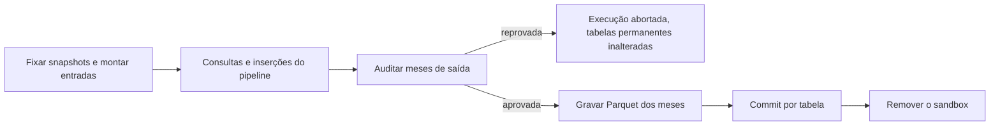

# Plano de implementação do serialize-db

Este documento reúne boas práticas de ETL e as sugestões de implementação derivadas delas, com base em
fontes consultadas em 2026-09-12 e 2026-09-13. O ambiente de destino é o do [CLAUDE.md](../CLAUDE.md):
Amazon SageMaker Unified Studio, S3, AWS Glue Data Catalog, um workgroup do Athena e Redshift com
leitura e escrita. As fontes estão no fim do documento e em [REFERENCES.md](../REFERENCES.md).

## Resumo das recomendações

1. As tabelas permanentes são tabelas Apache Iceberg v2 no AWS Glue Data Catalog, com dados em Parquet
   no S3 e partição por mês. Elas são a fonte da verdade, e DuckDB, Redshift, Athena e PyIceberg leem
   as mesmas tabelas.
2. Cada execução do pipeline trabalha num sandbox: um esquema próprio no Redshift ou um banco DuckDB do
   processo. O sandbox recebe só as partições que o pipeline declara ler, no snapshot fixado pela
   execução.
3. O pipeline principal grava meses inteiros no sandbox. A publicação audita os meses, grava os arquivos
   Parquet e troca os meses na tabela permanente com um commit do PyIceberg por tabela. Reexecutar um
   mês substitui a partição.
4. Correções em meses antigos e alterações em tabelas de domínio rodam em pipelines separados, com a
   mesma primitiva: reescrever no sandbox o mês, ou a tabela de domínio inteira, e substituir. Nenhum
   pipeline altera linhas isoladas nas tabelas permanentes.
5. A biblioteca faz o commit, não os motores. O Redshift não confirma `DELETE` e `INSERT` numa tabela
   Iceberg na mesma transação, e o `DELETE` do DuckDB em Iceberg grava arquivos de exclusão em vez de
   descartar arquivos. Nenhum dos dois repete um commit que colide com outro escritor.
6. Os modelos ORM continuam como fonte única do esquema. Deles derivam o DDL das tabelas do sandbox, o
   esquema Iceberg, o esquema Arrow e as auditorias.
7. O Apache Arrow é o formato de troca em memória. O SQLAlchemy compila as consultas com o dialeto do
   backend, e `schema_translate_map` aponta os modelos para o sandbox.
8. Uma prova de conceito no ambiente real vem antes da implementação. Ela cobre as permissões do Lake
   Formation, o commit de arquivos gravados pelo DuckDB e pelo `UNLOAD` e a leitura das mesmas tabelas
   pelos dois motores.

## Custo da reconstrução atual

A reconstrução atual leva cerca de 7 horas antes de o pipeline começar. O custo tem duas causas:

- A ingestão no PostgreSQL é lenta. Com DuckDB e Redshift, a equipe mediu a ingestão da base inteira em
  poucos minutos.
- O protocolo reconstrói a base inteira, embora o pipeline dependa de poucas partições.

Trocar o banco resolve a primeira causa. A segunda exige mudar o protocolo: carregar só o que o
pipeline lê. Este plano trata das duas.

## Boas práticas de ETL aplicáveis

### Partições imutáveis e substituição idempotente

O mês (`YYYY-MM`) é a unidade de escrita das tabelas particionadas. Uma reexecução ou correção grava o
mês inteiro de novo e substitui o anterior. Reexecuções ficam idempotentes, e a exportação incremental
se reduz a publicar os meses gravados.

### Write-Audit-Publish

Os dados novos são gravados numa área invisível aos leitores, auditados (contagem de linhas, nulos,
unicidade de chaves, limites de tipo) e só então publicados. Uma auditoria reprovada interrompe a
execução sem alterar as tabelas permanentes. O [sandbox da execução](#sandbox-da-execução) é essa área.

### Commit atômico nos metadados

O S3 não renomeia diretórios de forma atômica, e listar um prefixo mistura arquivos antigos, novos e
parciais. No Iceberg, cada commit grava um arquivo de metadados novo e troca, no catálogo, o ponteiro
para ele. Leitores veem o estado anterior ou o novo. Arquivos de uma execução que falhou antes do commit
não aparecem para nenhum leitor.

### Contrato de esquema

O esquema vive num único lugar, os modelos ORM, e dele derivam o DDL, o esquema Arrow, o esquema
Iceberg e as auditorias. O [etl-cookbook-tutorial](https://github.com/felipenoris/etl-cookbook-tutorial)
chama esse uso de "modelos como contrato".

## Ambiente AWS

| Serviço | Papel no plano |
| --- | --- |
| SageMaker Unified Studio | Executa o código do pipeline, o PyIceberg e o DuckDB. |
| S3 | Guarda dados e metadados das tabelas Iceberg e a área de staging. |
| AWS Glue Data Catalog | Catálogo das tabelas permanentes e otimizadores de manutenção. |
| Lake Formation | Permissões do catálogo nas bases sob seu controle. |
| Redshift | Backend de execução; lê as tabelas Iceberg pelo catálogo montado `awsdatacatalog`. |
| Athena | Consultas ad hoc às tabelas permanentes e manutenção sob demanda. |

### Execução no SageMaker Unified Studio

- Espaços JupyterLab e Code Editor rodam numa instância EC2 escolhida pelo usuário, com volume EBS de
  16 GB a 100 GB. O administrador limita o tamanho pelo parâmetro `maxEbsVolumeSize` do blueprint
  Tooling. O volume sobrevive a paradas da instância, e um EFS pode ser anexado ao espaço.
- O JupyterLab para depois de 60 minutos ocioso, por padrão.
- Execuções agendadas de notebooks rodam em outra instância, com tempo limite padrão de 60 minutos, e
  não enxergam arquivos locais da sessão interativa. Workflows do Airflow (MWAA Serverless ou
  provisionado) definem instância e tempo limite por etapa.
- O código roda com o papel IAM do projeto, compartilhado pelos membros. Buckets fora do projeto são
  liberados por políticas IAM ou de bucket, o Glue por permissões do Lake Formation, e workgroups do
  Athena e recursos do Redshift existentes por tags do projeto.
- Consultas ao Redshift a partir do JupyterLab exigem o Redshift na VPC do projeto.

O sandbox do DuckDB cabe na memória da instância mais o EBS do espaço, ou num EFS anexado. Pipelines
que não cabem nesse limite usam o backend Redshift.

### Permissões

- **Papel do projeto:** o PyIceberg cria e publica tabelas com `glue:GetTable`, `glue:CreateTable` e
  `glue:UpdateTable`. Nas bases sob o Lake Formation, o papel também precisa de `CREATE_TABLE`,
  `ALTER`, `INSERT`, `DELETE`, `lakeformation:GetDataAccess` e `DATA_LOCATION_ACCESS` nos locais
  registrados. O papel lê e grava no S3 dos locais das tabelas: o Lake Formation não bloqueia o acesso
  pela API do S3, e PyIceberg e DuckDB usam as credenciais do papel. Issues da extensão `iceberg` do
  DuckDB citam também `glue:GetIcebergTableMetadata` e a configuração do Lake Formation que libera
  acesso completo a motores externos.
- **Papel IAM do Redshift:** o papel precisa de acesso ao catálogo e de escrita no prefixo de dados das
  tabelas, para o `UNLOAD`.
- **Papel dos otimizadores do Glue:** o papel confia em `glue.amazonaws.com` e tem `s3:GetObject`,
  `s3:PutObject`, `s3:DeleteObject`, `s3:ListBucket`, `glue:GetTable`, `glue:UpdateTable` e acesso ao
  CloudWatch Logs. Sem concessão a `IAM_ALLOWED_PRINCIPALS`, ele também precisa de
  `lakeformation:GetDataAccess` e das permissões `ALTER`, `DESCRIBE`, `INSERT` e `DELETE` na tabela.
  Quem ativa o otimizador precisa de `iam:PassRole`.

## Estrutura do pipeline

| Critério | Opção 1: tabelas Iceberg como fonte da verdade | Opção 2: tabelas nativas do Redshift como fonte da verdade |
| --- | --- | --- |
| Tempo até o pipeline começar | Montagem das partições declaradas. | Nenhum no Redshift. |
| Backend DuckDB | Lê as tabelas permanentes direto do S3. | Depende de uma cópia completa em Parquet. |
| Exportação para Parquet | Os dados já estão em Parquet, e cada commit é incremental. | `UNLOAD` periódico. |
| Execuções concorrentes | Um sandbox por execução e commits validados por mês. | Um esquema por execução e publicação por transação no Redshift. |
| Recuperação | Snapshots do Iceberg, dentro da retenção. | Snapshots do Redshift. |
| Evolução de esquema | Metadados do Iceberg, sem reescrita em mudanças aditivas. | `ALTER TABLE`, com os limites do Redshift. |
| Outros leitores | Athena e qualquer motor com Iceberg. | Só o Redshift ou a exportação. |

Recomendação: opção 1. O sandbox por execução funciona nas duas opções. A opção 2 amarra os pipelines
ao Redshift e mantém a exportação para Parquet como tarefa separada.

## Tabelas permanentes em Iceberg

### Escolha do Iceberg

- Cada commit troca o ponteiro de metadados no Glue e gera um snapshot consultável.
- O particionamento oculto `month(data_ref)` poda arquivos a partir de filtros na própria coluna
  `data_ref`.
- A evolução de esquema usa IDs de coluna: adicionar, renomear, remover e alargar tipos alteram só
  metadados.
- Redshift, DuckDB, Athena e PyIceberg leem as mesmas tabelas, e o Glue faz a manutenção.

O formato v2 é o único que atende todos os motores. O Athena só aceita tabelas v2, o Redshift exige
Serverless (exceto 4 RPU) ou nós RG para tabelas v3, e o PyIceberg 0.12.0 não cria tabelas v3 no
`GlueCatalog`.

### Criação das tabelas

A biblioteca cria cada tabela com o `GlueCatalog` do PyIceberg, a partir do modelo:

- **Esquema:** tipos do [contrato](#tipos-no-contrato), com todos os campos opcionais. O `add_files`
  exige que um campo obrigatório na tabela também seja obrigatório no arquivo, e a obrigatoriedade das
  colunas nos arquivos do DuckDB e do `UNLOAD` não foi verificada. O `NOT NULL` fica no DDL do sandbox
  e na auditoria.
- **Partição:** `month(data_ref)` nas tabelas particionadas. Tabelas de domínio ficam sem partição.
- **Local:** um prefixo exclusivo por tabela, `s3://<bucket>/<prefixo>/<banco>/<tabela>/`. A remoção de
  arquivos órfãos do Glue varre o local da tabela, e locais sobrepostos permitem que ela apague
  arquivos de outra tabela.
- **Propriedades:** `serialize_db.revisao_esquema` com a revisão do Alembic,
  `write.target-file-size-bytes` com o tamanho alvo dos arquivos e `commit.retry.num-retries`.
- **Catálogo:** o `GlueCatalog` grava o arquivo de metadados no S3 e chama `UpdateTable` com
  `VersionId`. Ele é preferível ao endpoint Iceberg REST do Glue, cujas retentativas com SigV4 são mais
  fracas no PyIceberg (issue #3008). O `GlueCatalog` não arquiva uma versão da tabela no Glue a cada
  commit (`glue.skip-archive`, padrão `true`), o que preserva a cota de 100.000 versões por tabela.

### Arquivos de dados

- O DuckDB recomenda que um arquivo tenha pelo menos tantos row groups quanto threads de leitura. O row
  group padrão do DuckDB tem 122.880 linhas.
- O `UNLOAD` grava row groups de 32 MB.
- Ordenar os dados pela chave de ordenação antes de gravar permite descartar row groups pelas
  estatísticas de mínimo e máximo.
- A compactação do Glue trata como pequenos os arquivos abaixo de 75% de `write.target-file-size-bytes`
  (padrão 512 MB).

Sugestão: arquivos próximos do tamanho alvo da tabela, row groups entre 32 MB e 128 MB, compressão zstd
no DuckDB e ordenação pela chave de ordenação declarada no modelo. Arquivos do `UNLOAD` continuam em
SNAPPY; todos os leitores aceitam os dois codecs.

### Publicação de um mês

A publicação de cada tabela de saída segue estes passos:

1. O motor grava os arquivos do mês em `<local da tabela>/data/<mes>/<id_execucao>/`.
2. A biblioteca lê o rodapé de cada arquivo com `pyarrow.parquet.read_metadata` e confere o esquema, a
   contagem de linhas e o mínimo e o máximo de `data_ref` dentro do mês. O `add_files` deduz a partição
   dessas estatísticas e, sem elas, registra o arquivo sem partição e sem aviso.
3. A biblioteca compara os arquivos do mês no snapshot fixado pela execução com os do snapshot atual,
   pela coluna `file_path` de `tabela.inspect.files(snapshot_id=...)`. Uma diferença indica que outra
   execução publicou o mesmo mês, e a publicação é abortada.
4. Uma transação do PyIceberg remove o mês e adiciona os arquivos:

```python
filtro = "data_ref >= '2026-09-01' AND data_ref < '2026-10-01'"
propriedades = {"serialize_db.id_execucao": id_execucao}

with tabela.transaction() as tx:
    tx.delete(delete_filter=filtro, snapshot_properties=propriedades)
    tx.add_files(file_paths=arquivos, snapshot_properties=propriedades)
```

Comportamento do PyIceberg 0.12.0 nessa transação:

- A transação faz uma única chamada de commit ao catálogo. O histórico registra um snapshot de exclusão
  e um de inclusão.
- O `delete` descarta um arquivo sem lê-lo quando as métricas de coluna provam que todas as linhas
  atendem ao filtro: limites dentro do filtro e zero nulos. Caso contrário, ele reescreve o arquivo.
  Arquivos gravados por mês, com `data_ref` sem nulos, caem no primeiro caso.
- O `add_files` aceita arquivos sem field IDs e cria o name mapping da tabela quando ele não existe.
  Desde a versão 0.11.0, ele também aceita field IDs iguais aos da tabela. Ele rejeita timestamps em
  nanossegundos, colunas que a tabela não tem e arquivos já registrados (`check_duplicate_files`,
  padrão `true`).
- O `dynamic_partition_overwrite` só aceita transformações identidade e falha com `month`. Escritas em
  streaming (`pa.RecordBatchReader`) só funcionam em tabelas sem partição, e a documentação da função
  recomenda gravar Parquet e usar `add_files`.

### Concorrência entre publicações

- O PyIceberg 0.12.0 repete commits rejeitados pelo catálogo conforme as propriedades `commit.retry.*`
  da tabela (4 tentativas por padrão) e revalida cada tentativa. Versões anteriores falham na primeira
  colisão, então a biblioteca exige `pyiceberg>=0.12`.
- Com o isolamento serializável padrão do `delete`, arquivos que atendem ao filtro e que um commit
  concorrente adicionou ou removeu geram `ValidationException`.
- Duas execuções que publicam meses diferentes da mesma tabela concluem a publicação, e a segunda
  repete o commit. Duas que publicam o mesmo mês ao mesmo tempo terminam com uma falha. Se a segunda só começar a
  publicar depois do commit da primeira, o passo 3 detecta a colisão.
- Arquivos de exclusão de linha criados em paralelo conflitam mesmo em outras partições, segundo um
  comentário no código do PyIceberg. O Athena grava `MERGE`, `UPDATE` e `DELETE` como arquivos de
  exclusão de posição.

### Publicação de várias tabelas

O endpoint Iceberg REST do Glue não oferece transações entre tabelas, e o `GlueCatalog` confirma uma
tabela por vez. Durante a publicação de uma execução, um leitor pode ver o mês novo numa tabela e o
antigo em outra. A biblioteca encurta esse intervalo e o torna recuperável:

- Todas as auditorias e gravações de arquivos terminam antes do primeiro commit.
- Os commits seguem a ordem das chaves estrangeiras dos modelos.
- Cada snapshot registra `serialize_db.id_execucao`, o que identifica publicações parciais.
- Uma falha no meio da publicação se resolve reexecutando o mês, que é idempotente. Enquanto os
  snapshots antigos não expiram, a biblioteca também pode restaurar os meses já publicados com uma
  transação que remove os arquivos novos e adiciona os anteriores.

### Manutenção

O PyIceberg só expira snapshots nos metadados (`expire_snapshots`, sem apagar arquivos). Remoção de
órfãos e compactação são issues abertas. A manutenção fica com os otimizadores do Glue Data Catalog:

| Otimizador | Comportamento padrão |
| --- | --- |
| Compactação | A compactação só trata Parquet e roda quando uma tabela ou partição tem mais de 100 arquivos abaixo de 75% de `write.target-file-size-bytes`. As estratégias são `binpack` (padrão), `sort` e `z-order`; as duas últimas exigem ordem de classificação na tabela. O otimizador se suspende depois de 4 falhas seguidas. |
| Retenção de snapshots | A retenção mantém 5 dias e pelo menos 1 snapshot, apaga os arquivos expirados e roda a cada 24 horas. Cada execução apaga até 1.000.000 de arquivos. |
| Remoção de órfãos | A remoção apaga arquivos sem referência com mais de 3 dias, a cada 24 horas. Arquivos criados até o dia da criação do otimizador ficam preservados. |

- A otimização de tabelas Iceberg custa US$ 0,44 por DPU-hora, cobrada por segundo com mínimo de 1
  minuto.
- Uma view do DuckDB sobre um snapshot fixado falha se o snapshot expirar durante a execução. Isso só
  acontece com um snapshot que deixou de ser o atual e passou do período de retenção.
- Arquivos gravados por uma execução só viram órfãos removíveis se ela levar mais de 3 dias entre a
  gravação e o commit.
- O Athena oferece a mesma manutenção sob demanda, com `OPTIMIZE ... REWRITE DATA USING BIN_PACK` e
  `VACUUM`. Sem `s3:DeleteObject`, o `VACUUM` informa sucesso e não apaga nada.

### Alternativa sem Iceberg

Tabelas Parquet no estilo Hive, registradas no Glue, publicariam um mês trocando o local da partição
com `UpdatePartition` para um prefixo novo da execução. A alternativa dispensa arquivos de metadados,
mas tem limites:

- `UpdatePartition` e `BatchUpdatePartition` não verificam versão. Duas execuções no mesmo mês
  sobrescrevem uma à outra sem erro, e um lote pode ter sucesso parcial.
- Não existe snapshot fixado para leituras consistentes.
- A evolução de esquema depende da associação de colunas por nome, e a biblioteca precisaria projetar
  arquivos antigos no esquema atual. A documentação do Spectrum não define se colunas Parquet são
  associadas por nome ou por posição.
- O DuckDB não lê partições do Glue; a biblioteca listaria os locais com `boto3`.

A alternativa só vale se a prova de conceito descartar o Iceberg.

## Sandbox da execução

O sandbox isola uma execução das tabelas permanentes e das outras execuções. O pipeline lê e grava só
no sandbox, e a publicação é o único caminho até as tabelas permanentes.

### Isolamento por backend

| Aspecto | Redshift | DuckDB |
| --- | --- | --- |
| Sandbox | Esquema `execucao_<id>` com tabelas comuns. | Banco DuckDB do processo, em memória ou em arquivo local. |
| Nomes das tabelas | Os dos modelos, via `schema_translate_map`. | Os dos modelos. |
| Execuções concorrentes | Um esquema por execução. | Um processo por execução. |
| Limpeza | `DROP SCHEMA execucao_<id> CASCADE`. | Fim do processo ou remoção do arquivo. |

Um esquema por execução é preferível a um prefixo no nome das tabelas:

- Os modelos mantêm o `__tablename__`. O `schema_translate_map` redireciona todo SQL gerado a partir
  deles. Um prefixo exigiria copiar cada `Table` com outro nome, e as classes ORM continuariam ligadas
  aos nomes originais.
- `DROP SCHEMA ... CASCADE` remove o sandbox inteiro, e `CREATE SCHEMA ... QUOTA` limita o espaço de
  cada execução.
- O Redshift aceita até 9.900 esquemas por banco. Uma rotina de limpeza remove os esquemas de execuções
  que falharam.

No Redshift, o sandbox usa tabelas comuns, e não `CREATE TEMP TABLE`:

- Uma tabela temporária só é visível na sessão que a criou e some ao fim dela.
- No Redshift Serverless, sessões ociosas terminam depois de 1 hora. Na Data API, a sessão termina com
  o comando, exceto com `SessionKeepAliveSeconds` (máximo de 24 horas).
- Uma reconexão ou uma segunda conexão do pool perderia o sandbox.

No DuckDB, um arquivo de banco aceita um único processo com escrita. Execuções concorrentes não
compartilham um arquivo DuckDB, o que também descarta um banco DuckDB como tabela permanente.

### Montagem das entradas

O pipeline declara as partições que lê. A execução fixa o snapshot atual de cada tabela quando a monta
ou a declara como saída, e toda leitura dessa tabela usa esse snapshot.

| Montagem | DuckDB | Redshift |
| --- | --- | --- |
| Cópia (padrão) | `INSERT INTO <tabela> BY NAME SELECT ... FROM glue.<banco>.<tabela> AT (VERSION => <snapshot>)` com o filtro dos meses. | `INSERT INTO execucao_<id>.<tabela> SELECT ... FROM awsdatacatalog.<banco>.<tabela>` com o filtro dos meses. |
| Referência | View sobre a tabela no snapshot fixado; nenhum dado é copiado. | Indisponível: o Redshift não consulta snapshots anteriores. |

- As tabelas do sandbox usam o DDL do modelo, não a inferência do motor.
- O Redshift lê sempre o snapshot atual. Depois da cópia, a biblioteca compara o snapshot atual com o
  fixado e repete a cópia se um commit intermediário alterou os meses copiados.
- Tabelas de domínio são montadas inteiras.
- Uma tabela de saída não recebe cópia dos meses que a execução publica, exceto nos pipelines de
  correção.

### Tabelas de saída e auditoria

- `declarar_saida` cria no sandbox as tabelas de saída que ainda não existem e registra os meses
  publicados.
- A auditoria roda no sandbox, com consultas geradas a partir do modelo: linhas por mês, nulos em
  colunas `NOT NULL`, unicidade da chave primária, tamanho em bytes de `VARCHAR(n)` e linhas fora dos
  meses declarados.
- A consulta de unicidade tem a forma
  `SELECT <pk>, COUNT(*) FROM <tabela> WHERE <meses novos> GROUP BY <pk> HAVING COUNT(*) > 1`. Quando a
  chave primária não contém a coluna de partição, a auditoria também cruza os meses novos com os meses
  publicados.

### Ciclo de uma execução



O sandbox de uma execução abortada fica disponível para inspeção até a rotina de limpeza.

## Pipelines separados

### Pipeline principal

O pipeline principal só cria meses e pode substituir um mês existente numa reexecução. Ele lê as
tabelas de domínio no snapshot fixado e nunca as altera.

### Correções em meses antigos

Recomendação: o pipeline de correção monta o mês a corrigir, aplica `UPDATE` e `DELETE` no sandbox,
audita e substitui o mês. A primitiva de publicação e a auditoria são as do pipeline principal, e o
custo é proporcional ao tamanho do mês.

A alternativa é `MERGE`, `UPDATE` ou `DELETE` direto na tabela Iceberg, pelo Athena ou pelo Redshift:

- O Athena grava essas operações como arquivos de exclusão de posição. Esses arquivos exigem
  compactação e conflitam com commits concorrentes mesmo em outras partições.
- As linhas alteradas não passam pela auditoria do sandbox.
- O Redshift não repete commits que colidem com outro escritor; a documentação manda reexecutar.

### Tabelas de domínio

O pipeline de domínio monta a tabela inteira, aplica as mudanças no sandbox, audita e substitui a
tabela inteira num commit. Tabelas pequenas podem usar `tabela.overwrite(dados_arrow)`, que troca a
tabela num commit sem arquivos intermediários. Um histórico de valores exige colunas de vigência no
modelo, porque os snapshots antigos expiram com a retenção.

### Execuções simultâneas

| Situação | Resultado |
| --- | --- |
| Meses diferentes da mesma tabela | As duas publicam; a segunda repete o commit. |
| Mesmo mês | A segunda publicação é abortada. |
| Mês de entrada alterado durante a execução | A execução segue com o snapshot fixado. Na publicação, a biblioteca compara as entradas com o snapshot atual e registra um aviso ou aborta, conforme configuração. |

## Esquema a partir dos modelos ORM

### DDL gerado ou escrito à mão

Recomendação: gerar o DDL a partir dos modelos. O DDL gerado cobre as tabelas do sandbox no DuckDB e no
Redshift e o esquema Iceberg. As vantagens do DDL manual, revisão explícita e opções físicas, vêm de
dois mecanismos:

- Opções físicas no próprio modelo, num espaço de nomes da biblioteca em `Table.info`. A chave de
  ordenação vira `SORTKEY` no Redshift e `ORDER BY` na gravação dos arquivos.
- Arquivos `.sql` com o DDL gerado por backend e um JSON com o esquema Iceberg, versionados no
  repositório do pipeline e comparados por um teste. Uma mudança no modelo aparece no diff.

```python
class Operacao(Base):
    __tablename__ = "operacoes"
    __table_args__ = {
        "info": {
            "serialize_db": {
                "particionamento": {"coluna": "data_ref", "transformacao": "month"},
                "chave_ordenacao": ["data_ref", "id_operacao"],
                "redshift": {"diststyle": "KEY", "distkey": "id_cliente"},
            }
        }
    }

    id_operacao: Mapped[int] = mapped_column(BigInteger, primary_key=True)
    data_ref: Mapped[date] = mapped_column(primary_key=True)
    id_cliente: Mapped[int] = mapped_column(BigInteger)
    valor: Mapped[Decimal] = mapped_column(Numeric(18, 2))
    descricao: Mapped[str | None] = mapped_column(String(200))
```

O `sqlalchemy-redshift` aceita `redshift_diststyle`, `redshift_distkey`, `redshift_sortkey` e
`redshift_interleaved_sortkey` como argumentos de `Table`. Guardar as opções em `info` mantém os
modelos neutros quando o dialeto do Redshift não está instalado.

### Política de restrições

| Restrição | Sandbox DuckDB | Sandbox Redshift | Tabela Iceberg |
| --- | --- | --- | --- |
| `NOT NULL` | Declarada. | Declarada e aplicada pelo banco. | Campo opcional; a auditoria verifica. |
| `PRIMARY KEY`, `UNIQUE` | Omitida; a auditoria verifica os meses novos. | Declarada quando auditada; informativa. | Não declarada. |
| `FOREIGN KEY` | Omitida; auditoria opcional. | Declarada quando auditada; informativa. | Não declarada. |

Unicidade, chave primária e chave estrangeira são informativas no Redshift. O planejador usa essas
chaves para decorrelacionar subconsultas, ordenar e eliminar joins, e supõe que elas são válidas. Com
chaves inválidas, consultas retornam resultados errados; a documentação cita um `SELECT DISTINCT` que
devolve duplicatas. `NOT NULL` é aplicado. Tabelas Iceberg no Redshift não aceitam restrições.

A medição publicada na documentação do DuckDB, com 554 milhões de linhas, justifica omitir chaves no
DuckDB:

| Operação | Tempo |
| --- | --- |
| Carga com chave primária | 461,6 s |
| Carga sem chave primária | 121,0 s |
| Criação da chave primária após a carga | 242,0 s |

A documentação recomenda não declarar restrições no DuckDB, exceto para garantir integridade. Índices
ART precisam caber em memória durante a criação.

### Tipos no contrato

| SQLAlchemy | Arrow | Iceberg | DuckDB | Redshift | Observação |
| --- | --- | --- | --- | --- | --- |
| `SmallInteger` | `int16` | `int` | `SMALLINT` | `SMALLINT` | O Iceberg não tem inteiro de 16 bits; a gravação converte para `int32`. |
| `Integer` | `int32` | `int` | `INTEGER` | `INTEGER` | |
| `BigInteger` | `int64` | `long` | `BIGINT` | `BIGINT` | Tipos sem sinal do Arrow e do DuckDB ficam fora do contrato. |
| `Boolean` | `bool` | `boolean` | `BOOLEAN` | `BOOLEAN` | |
| `Double` | `float64` | `double` | `DOUBLE` | `DOUBLE PRECISION` | Descarregar e recarregar pelo Redshift pode perder precisão. |
| `Numeric(p, s)` | `decimal128(p, s)` | `decimal(p, s)` | `DECIMAL(p, s)` | `DECIMAL(p, s)` | `p` até 38. |
| `String(n)` | `string` | `string` | `VARCHAR` | `VARCHAR(n)` | `n` em bytes no Redshift; auditoria de tamanho. |
| `Text` | `string` | `string` | `VARCHAR` | `VARCHAR(65535)` | `TEXT` no Redshift vira `VARCHAR(256)`. |
| `Date` | `date32` | `date` | `DATE` | `DATE` | |
| `DateTime` | `timestamp[us]` | `timestamp` | `TIMESTAMP` | `TIMESTAMP` | Cast explícito de nanossegundos (padrão do pandas) para microssegundos; o `add_files` rejeita nanossegundos. O Athena lê com precisão de milissegundos. |
| `DateTime(timezone=True)` | `timestamp[us, tz=UTC]` | `timestamptz` | `TIMESTAMPTZ` | `TIMESTAMPTZ` | Gravar sempre em UTC; o `UNLOAD` descarta o fuso. |
| `Uuid` | `string` | `string` | `VARCHAR` | `VARCHAR(36)` | O Redshift não tem tipo UUID. |
| `JSON`, `LargeBinary`, `ARRAY`, `Interval` | | | | | Fora do contrato até haver um caso de uso. |

## Evolução de esquema

### Classes de mudança

| Mudança | Operação no Iceberg | Arquivos existentes |
| --- | --- | --- |
| Nova tabela | `create_table`. | Não existem. |
| Nova coluna anulável | `add_column`. | Leitores devolvem `NULL`. |
| Alargamento: `int` para `long`, `float` para `double`, `decimal` com mais precisão | `update_column`. | Sem reescrita. |
| `String(n)` com `n` maior | Nenhuma; o Iceberg não guarda tamanho. | Sem reescrita; muda o DDL do sandbox. |
| Renomeação de coluna | `rename_column`. | Sem reescrita, se os leitores resolverem o nome antigo. |
| Remoção de coluna | `delete_column`. | Sem reescrita. |
| Mudança de particionamento | `update_spec`. | Mantêm a especificação antiga. |
| Estreitamento, mudança de significado, nova coluna `NOT NULL` sem valor padrão | Reescrita dos meses afetados pelo sandbox. | Substituídos. |

### Renomeação e name mapping

- O Iceberg resolve colunas por field ID. Arquivos sem field IDs dependem do name mapping da tabela
  (`schema.name-mapping.default`).
- O `add_files` cria o name mapping quando a tabela não tem um, e o `rename_column` do PyIceberg mantém
  o nome antigo como alias.
- O DuckDB resolve colunas renomeadas por field ID e falha em arquivos que não têm field IDs nem name
  mapping (issue #660). A documentação do Redshift não diz se ele aplica o name mapping.
- O `COPY` do DuckDB grava field IDs com a opção `FIELD_IDS`, e o `add_files` aceita esses arquivos se
  os IDs coincidem com os da tabela. A documentação do `UNLOAD` não menciona field IDs.

A biblioteca grava field IDs nos arquivos do DuckDB. A prova de conceito verifica a leitura de colunas
renomeadas em arquivos do `UNLOAD` pelos dois motores. Sem essa garantia, renomear uma coluna exige
reescrever os meses gravados pelo `UNLOAD`.

### Integração com Alembic

- A revisão do Alembic fica na propriedade `serialize_db.revisao_esquema` de cada tabela.
- A biblioteca percorre o grafo de revisões do Alembic e aplica, em cada revisão, as operações de
  esquema pelo PyIceberg (`update_schema`, `update_spec`). Renomeações são declaradas na revisão, por
  exemplo `ctx.renomear_coluna("operacoes", "valor", "valor_brl")`, porque a comparação de modelos não
  distingue renomeação de remoção seguida de inclusão.
- Mudanças que exigem reescrita definem `upgrade_dataset(ctx)` no script da revisão. O comando
  `serialize-db migrar` aplica as revisões pendentes e reescreve os meses pelo sandbox.
- As tabelas do sandbox não precisam de migração: cada execução as cria a partir dos modelos atuais.
- As migrações usam o PyIceberg, e não SQL. O Athena não executa DDL em tabelas Iceberg registradas no
  Lake Formation, e o `ALTER TABLE` do Redshift falha ao renomear colunas dessas tabelas.

## Redshift

### Leitura das tabelas Iceberg

- O Redshift monta o Glue Data Catalog automaticamente como `awsdatacatalog`, em nós RG e RA3 e no
  Serverless. O acesso exige `GRANT USAGE ON DATABASE awsdatacatalog`, login com identidade IAM e nomes
  em três partes, sem `search_path`.
- Um esquema externo `CREATE EXTERNAL SCHEMA ... FROM DATA CATALOG` com `IAM_ROLE` permite nomes em
  duas partes.
- Com Lake Formation, o Redshift precisa de um papel IAM com acesso ao catálogo ou de identidade
  federada, sem encadeamento de papéis.
- O Redshift poda partições e arquivos. A documentação não diz se um filtro em `data_ref` poda
  partições `month(data_ref)`; a prova de conceito mede.
- O Redshift não consulta snapshots anteriores. Cada consulta vê um snapshot consistente.

### Sandbox no Redshift

- A execução cria `execucao_<id>` com `CREATE SCHEMA ... QUOTA` e as tabelas pelo DDL do modelo, com
  `DISTKEY`, `SORTKEY` e a política de restrições.
- A cota conta tabelas comuns, views materializadas e as cópias por nó de tabelas com distribuição
  `ALL`, e é verificada no commit. Uma transação que a excede é desfeita.
- O isolamento `SNAPSHOT` é o padrão no Serverless e em clusters provisionados criados ou restaurados
  desde 2024-05-22. Execuções não compartilham tabelas no Redshift, então não geram conflitos de
  escrita entre si.
- Identificadores têm até 127 bytes, o que limita o tamanho de `<id>`.

### Carga de DataFrames com COPY

A documentação do Redshift recomenda `COPY` para cargas e `INSERT` com várias linhas apenas quando
`COPY` não é possível. O `INSERT` grande da biblioteca atual vira este fluxo:

1. Converter o DataFrame numa tabela Arrow com o esquema do modelo (cast seguro).
2. Gravar Parquet em `s3://<bucket>/<prefixo>/staging/<id_execucao>/<tabela>/`, fora dos locais das
   tabelas Iceberg.
3. `COPY execucao_<id>.<tabela> FROM '<manifesto>' IAM_ROLE '<arn>' FORMAT AS PARQUET MANIFEST`.
4. Comparar `pg_last_copy_count()` com o número de linhas enviadas.

Uma regra de ciclo de vida do S3 apaga o prefixo de staging.

Implementações existentes servem de referência ou dependência:

- `awswrangler.redshift.copy` (versão 3.17.1, 2026-08-03) executa o mesmo fluxo.
- O driver ADBC para Redshift (versão 1.7.0, 2026-09-09) faz ingestão em bloco e leitura em Arrow. Ele
  merece um benchmark contra o fluxo acima.

### Regras do COPY para Parquet

| Regra da documentação | Consequência para a biblioteca |
| --- | --- |
| Colunas são associadas por posição, e a quantidade precisa coincidir com a tabela. | A ordem das colunas no Parquet é a ordem do modelo. Os dois derivam do mesmo `Table`. |
| Só existem as colunas gravadas no arquivo. | Colunas de partição ficam dentro do arquivo. |
| Parâmetros aceitos: `ACCEPTINVCHARS`, `FILLRECORD`, `FROM`, `IAM_ROLE`, `CREDENTIALS`, `STATUPDATE`, `MANIFEST`, `EXPLICIT_IDS`. `MAXERROR` não é aceito. | O primeiro erro aborta o `COPY`. A validação acontece antes, no Arrow. |
| `MANIFEST` é aceito. | O `COPY` carrega exatamente os arquivos gravados pela biblioteca. |
| O bucket precisa estar na mesma região do Redshift. | Configuração da infraestrutura. |
| O `COPY` de Parquet usa URLs pré-assinadas válidas por 1 hora. | Políticas IAM do bucket não podem bloquear URLs pré-assinadas. |

### Exportação com UNLOAD

Comportamento do `UNLOAD ... FORMAT AS PARQUET` segundo a documentação:

- O `UNLOAD` grava Parquet 1.0. Cada row group é comprimido com SNAPPY. O row group padrão tem 32 MB;
  `ROWGROUPSIZE` aceita de 32 MB a 128 MB em alguns tipos de nó.
- `MAXFILESIZE` aceita de 5 MB a 6,2 GB (padrão 6,2 GB) e é arredondado para baixo até um múltiplo de
  32 MB.
- Com `PARTITION BY`, as colunas de partição saem dos arquivos, exceto com `INCLUDE`.
- `CLEANPATH` apaga de forma permanente os arquivos das pastas de partição que recebem dados novos.
- Colunas `TIMESTAMPTZ` perdem a informação de fuso horário.
- O `SELECT` externo não aceita `LIMIT`.
- `MANIFEST VERBOSE` lista os arquivos, os nomes e tipos das colunas e as linhas por arquivo.
- Colunas `VARBYTE`, `GEOMETRY` e `HLLSKETCH` só saem em texto ou CSV.

Sugestão: um `UNLOAD` por mês, sem `PARTITION BY`, com destino `<local da tabela>/data/<mes>/<id_execucao>_`
e `MANIFEST VERBOSE`. O `SELECT` lista as colunas na ordem do modelo, com casts para os tipos do
contrato e `ORDER BY` pela chave de ordenação. A biblioteca confere o manifesto do `UNLOAD` e os
rodapés dos arquivos antes da publicação. `CLEANPATH` não é usado: arquivos de execuções abortadas
saem pela remoção de órfãos do Glue.

A documentação do `UNLOAD` não informa os tipos físicos Parquet de `TIMESTAMP` e `DECIMAL`, a
obrigatoriedade das colunas nem a presença de estatísticas de mínimo e máximo. Os três afetam o
`add_files`, e a prova de conceito verifica.

### Escrita direta em Iceberg pelo Redshift

O Redshift grava em tabelas Iceberg desde 2025-11-17, com `UPDATE`, `DELETE` e `MERGE` desde
2026-04-23, `ALTER TABLE` desde 2026-05-18 e Iceberg v3 desde agosto de 2026. Ele aceita partições
`month` e remove uma partição inteira só nos metadados. Mesmo assim, a biblioteca não publica meses por
esse caminho:

- Um bloco de transação aceita um único comando de escrita em Iceberg. `DELETE` e `INSERT` na mesma
  tabela não são confirmados juntos, e uma transação não mistura tabelas Iceberg e nativas.
- Quando duas transações alteram a mesma tabela ou partição, o commit falha e o Redshift não repete.
- Tabelas criadas por outros motores precisam ser v2 ou v3, com Parquet como formato padrão, sem
  compressão de metadados e sem o recurso de WAP do Iceberg.

### Tipos de dados

- `TEXT` vira `VARCHAR(256)`, e `VARCHAR` sem tamanho também tem 256 bytes.
- O tamanho de `VARCHAR` é medido em bytes; um caractere UTF-8 ocupa até 4 bytes. O máximo é 65535
  bytes.
- A documentação recomenda o menor tamanho de coluna que comporte os dados.
- O DuckDB não aplica o tamanho de `VARCHAR(n)`. Dados aceitos no DuckDB podem estourar o limite no
  Redshift.

Sugestão: exigir `String(n)` nos modelos. `Text` vira `VARCHAR(65535)` com aviso. A auditoria mede o
tamanho em bytes com `pyarrow.compute.binary_length` antes do `COPY`.

## Suporte ao DuckDB

### Leitura das tabelas permanentes

A extensão `iceberg` do `duckdb` 1.5.5 (2026-07-22) anexa o Glue Data Catalog pelo endpoint Iceberg
REST do Glue. O README da extensão a classifica como experimental.

```sql
CREATE SECRET (TYPE s3, PROVIDER credential_chain, REGION '<regiao>');
ATTACH '<id_da_conta>' AS glue (TYPE iceberg, ENDPOINT_TYPE 'glue');

SELECT *
FROM glue.<banco>.operacoes AT (VERSION => <snapshot>)
WHERE data_ref >= DATE '2026-06-01' AND data_ref < DATE '2026-09-01';
```

- A poda por `month()` funciona. Em tabelas muito grandes, a extensão carrega todos os manifestos antes
  de podar (issue #995); a correção só existe na linha 2.0.
- Consultas a `information_schema` com o Glue anexado levam minutos (issue #1290), e `LIMIT` lê todos os
  manifestos (issue #1369). A biblioteca não reflete o catálogo anexado.
- Arquivos de exclusão de posição e deletion vectors são lidos. Arquivos de exclusão por igualdade
  ficam lentos em volume.

Sem a extensão, `tabela.scan(row_filter=..., snapshot_id=...).plan_files()` do PyIceberg devolve os
arquivos do snapshot fixado, e `read_parquet` lê a lista. O caminho só vale enquanto a tabela não
tiver arquivos de exclusão nem colunas renomeadas. O filtro precisa ser reaplicado na consulta, e
arquivos de exclusão por igualdade fazem o planejamento falhar.

### Escrita em Iceberg pelo DuckDB

A extensão grava em tabelas Iceberg (`CREATE TABLE`, `INSERT`, `UPDATE`, `DELETE`, `MERGE INTO`,
`ALTER TABLE`), mas a biblioteca não publica meses por esse caminho:

- `UPDATE`, `DELETE` e `MERGE` só funcionam em merge-on-read e gravam arquivos de exclusão de posição.
  A documentação diz que copy-on-write ainda não é suportado.
- Qualquer commit concorrente na mesma tabela derruba a transação, mesmo em outra partição, e a versão
  1.5 não repete (issues #1162 e #786). Só a linha 2.0 repete `INSERT` e, com
  `write.delete.isolation-level=snapshot`, `DELETE`.
- `UPDATE` e `DELETE` só funcionam em tabelas sem ordem de classificação.
- Escritas particionadas não dividem arquivos por tamanho, e cada comando adiciona um manifesto.

### Sandbox, inserção e exportação

- O sandbox é um banco em memória ou num arquivo local. Com `memory_limit`, operações maiores que a
  memória vão para `temp_directory`, no EBS do espaço.
- O DuckDB lê tabelas Arrow sem cópia. `INSERT INTO <tabela> BY NAME SELECT * FROM entrada`, com
  `entrada` registrada na conexão, associa as colunas por nome. DataFrames pandas e polars são
  convertidos para Arrow com o esquema do modelo antes da inserção, o que evita surpresas de dtype como
  inteiros com nulos convertidos para float.
- A exportação usa o writer paralelo do DuckDB. `FILE_SIZE_BYTES` divide o mês em vários arquivos, e
  `FIELD_IDS` grava os field IDs da tabela Iceberg:

```sql
COPY (
    SELECT <colunas com cast> FROM <tabela> WHERE <mês> ORDER BY <chave de ordenação>
) TO '<local da tabela>/data/<mes>/<id_execucao>' (
    FORMAT parquet,
    COMPRESSION zstd,
    FILE_SIZE_BYTES '<tamanho alvo>',
    FIELD_IDS {<coluna>: <field ID>}
);
```

### DuckLake

O DuckLake 1.0 (abril de 2026) guarda metadados num banco SQL, e nenhuma fonte consultada indica leitura
pelo Redshift. Com o Glue como catálogo, ele fica fora do plano.

## SQLAlchemy nas consultas

### Dialetos

Versões no PyPI em 2026-09-12:

| Pacote | Versão | Data | Observação |
| --- | --- | --- | --- |
| `SQLAlchemy` | 2.0.52 | 2026-08-11 | |
| `sqlalchemy-redshift` | 1.0.0 | 2026-04-28 | Migrou para SQLAlchemy 2.0; exige `redshift_connector` ou `psycopg2` instalado à parte. |
| `redshift-connector` | 2.1.16 | 2026-08-03 | Driver oficial da AWS. |
| `duckdb` | 1.5.5 | 2026-07-22 | |
| `duckdb-engine` | 0.17.0 | 2025-03-29 | Última versão com mais de um ano. |
| `alembic` | 1.20.0 | 2026-09-11 | |
| `pyarrow` | 25.0.1 | 2026-08-10 | |
| `awswrangler` | 3.17.1 | 2026-08-03 | Fixa `pyarrow<26`. |
| `pyiceberg` | 0.12.0 | 2026-09-01 | Primeira versão com retentativa de commit e validação de conflitos. |

O `duckdb-engine` sem versão há mais de um ano é um risco de manutenção. A biblioteca o usa só para
compilar SQL e DDL, e as consultas rodam na conexão nativa do DuckDB. Trocar de dialeto afeta apenas
a compilação.

### Compilação e execução

- O pipeline monta `select()` a partir dos modelos, como hoje. `execucao.consultar(consulta)` compila
  com o dialeto do backend e executa na conexão nativa.
- No DuckDB, o resultado sai em Arrow direto da conexão.
- No Redshift, resultados pequenos saem pelo cursor do `redshift_connector`. Resultados grandes saem
  por `UNLOAD` para Parquet no prefixo de staging e leitura com `pyarrow.dataset`. Se a consulta tiver
  `LIMIT` no `SELECT` externo, a biblioteca a envolve numa subconsulta. O limite entre os dois caminhos
  é configurável, e o driver ADBC entra no benchmark como terceira opção.
- A biblioteca expõe um `Engine` para código do pipeline que já usa `pandas.read_sql`.
- No Redshift, `execution_options(schema_translate_map={None: "execucao_<id>"})` aponta os modelos para
  o sandbox sem alterá-los. No DuckDB, as tabelas do sandbox ficam no esquema padrão.

### Portabilidade de SQL entre DuckDB e Redshift

- As consultas usam construções do SQLAlchemy, não SQL em texto.
- Funções com nomes ou semânticas diferentes nos dois bancos ganham uma regra `@compiles` por dialeto.
  A lista sai do código atual do pipeline.
- O DuckDB aceita construções do PostgreSQL ausentes no Redshift, como arrays e `ON CONFLICT`. Uma
  consulta que roda no DuckDB pode falhar no Redshift, então as consultas do pipeline precisam de
  testes de integração no Redshift com uma amostra pequena.

## Arquitetura do pacote

### Módulos

```text
src/serialize_db/
  contrato/        mapeamento de tipos, esquemas Arrow e Iceberg, auditorias
  catalogo/        GlueCatalog, snapshots fixados, publicação e validação de meses
  backends/
    base.py        protocolo Backend
    duckdb.py
    redshift.py
  execucao.py      sandbox: montar, declarar saída, auditar, exportar, publicar, limpar
  migracoes/       Alembic sobre o PyIceberg e reescrita de meses
  cli.py
```

Dependências sugeridas no `pyproject.toml`: `sqlalchemy`, `pyarrow` e `pyiceberg[glue]>=0.12` na base;
extras `duckdb` (`duckdb`, `duckdb-engine`), `redshift` (`sqlalchemy-redshift`, `redshift-connector`)
e `migracoes` (`alembic`).

### API

```python
from serialize_db import Catalogo, Execucao
from serialize_db.backends.duckdb import BackendDuckDB

catalogo = Catalogo.glue(banco="<banco>", regiao="<regiao>")
backend = BackendDuckDB(memory_limit="48GB", temp_directory="<diretório no EBS>")

with Execucao(catalogo, backend, metadata=Base.metadata) as execucao:
    execucao.montar(Operacao, meses=["2026-06", "2026-07", "2026-08"])
    execucao.montar(HistoricoPrecos, meses=["2026-08"], referencia=True)
    execucao.montar(Cliente)
    execucao.declarar_saida(Operacao, meses=["2026-09"])

    saldos = execucao.consultar(
        select(Operacao.id_cliente, func.sum(Operacao.valor)).group_by(Operacao.id_cliente)
    )  # pyarrow.Table

    execucao.inserir(Operacao, df_novas_operacoes)  # pandas, polars ou pyarrow

    execucao.publicar()
```

- `montar` fixa o snapshot da tabela e copia os meses pedidos para o sandbox. Sem `meses`, a cópia é
  da tabela inteira. Com `referencia=True`, o DuckDB cria uma view em vez de copiar.
- `declarar_saida` registra os meses que a execução publica.
- `publicar` audita, grava os arquivos, valida e faz um commit por tabela. Uma exceção dentro do bloco
  `with` aborta a execução sem publicar.

```python
class Backend(Protocol):
    dialeto: Dialect

    def criar_sandbox(self, id_execucao: str) -> None: ...
    def criar_tabelas(self, tabelas: Sequence[Table], politica: PoliticaRestricoes) -> None: ...
    def montar(self, tabela: Table, origem: SnapshotFixado, meses: Sequence[Mes] | None, referencia: bool) -> None: ...
    def inserir(self, tabela: Table, dados: pa.Table) -> int: ...
    def consultar(self, consulta: Select) -> pa.Table: ...
    def auditar(self, tabela: Table, meses: Sequence[Mes]) -> list[Violacao]: ...
    def exportar(self, tabela: Table, mes: Mes, destino: str) -> list[ArquivoParquet]: ...
    def remover_sandbox(self) -> None: ...
```

## Testes

- Testes de unidade com DuckDB em memória e um `SqlCatalog` do PyIceberg sobre SQLite, com warehouse
  em `tmp_path`. A documentação do PyIceberg restringe o SQLite a desenvolvimento. O commit usa um
  `UPDATE` condicional, então colisões entre escritores acontecem de fato. O DuckDB lê essas tabelas
  com `iceberg_scan` sobre o arquivo de metadados.
- Teste de ida e volta do contrato: modelo, Arrow, Parquet gravado pelo DuckDB, `add_files` e leitura
  pelo PyIceberg, com tipos iguais.
- Testes de concorrência: duas publicações em meses diferentes terminam; duas no mesmo mês terminam
  com uma falha; uma entrada alterada durante a execução gera aviso ou erro.
- Testes de snapshot do DDL e das consultas compiladas para o Redshift, sem rede.
- Testes de integração com o marcador `aws`, ignorados sem credenciais, contra uma base do Glue, um
  prefixo do S3 e um workgroup do Redshift dedicados. Eles cobrem `UNLOAD` com `add_files`, leitura
  pelo `awsdatacatalog` e pela extensão `iceberg` do DuckDB, e permissões do Lake Formation.
- Benchmark do tempo até o pipeline começar, por backend, com dados reais. A linha de base é a
  importação de cerca de 7 horas no PostgreSQL.

## Roteiro de implementação

1. Prova de conceito no SageMaker Unified Studio, com uma tabela de teste numa base do Glue:
   - criação da tabela v2 pelo `GlueCatalog` e permissões do papel do projeto, do Redshift e dos
     otimizadores do Glue;
   - publicação de um mês com `delete` e `add_files`, com arquivos do `COPY` do DuckDB e do `UNLOAD`:
     tipos, obrigatoriedade de colunas, estatísticas e remoção só nos metadados;
   - leitura pelo DuckDB (`ENDPOINT_TYPE 'glue'` e `AT (VERSION => ...)`) e pelo Redshift
     (`awsdatacatalog`), com poda por mês;
   - leitura de coluna renomeada pelos dois motores, em arquivos com e sem field IDs;
   - duas publicações simultâneas, em meses diferentes e no mesmo mês;
   - otimizadores do Glue ativos na tabela de teste.
2. Contrato e catálogo: tipos, esquemas Arrow e Iceberg, criação de tabelas, publicação de meses com
   validação e testes com `SqlCatalog`.
3. Backend DuckDB: sandbox, montagem, inserção, auditoria e exportação. A fase termina com a medição do
   tempo até o pipeline começar.
4. Backend Redshift: esquema por execução, montagem pelo `awsdatacatalog`, `COPY` de DataFrames,
   `UNLOAD` e limpeza de esquemas.
5. Pipelines separados: substituição de tabelas de domínio e correção de meses.
6. Evolução de esquema: Alembic sobre o PyIceberg e reescrita de meses.
7. Adoção do dataset atual: criar as tabelas Iceberg a partir dos modelos e registrar os arquivos
   Parquet existentes com `add_files` quando cada arquivo tiver um único mês e tipos compatíveis com o
   contrato. Os demais arquivos são regravados pelo DuckDB.
8. Avaliações: driver ADBC para Redshift e escrita direta pelo DuckDB 2.0, que repete commits de
   `INSERT`.

## Questões em aberto

- Qual o volume do dataset: tamanho total, maiores tabelas, linhas por mês?
- Uma execução do pipeline principal produz o mês inteiro ou só uma data dentro do mês? No segundo caso,
  a unidade de substituição é a data, e a publicação precisa de outra estratégia.
- O pipeline principal roda para meses diferentes ao mesmo tempo? Pipelines de correção e de domínio
  rodam junto com ele?
- As bases do Glue do projeto estão sob permissões do Lake Formation? O papel do projeto grava direto no
  S3 das tabelas?
- O Redshift é Serverless ou provisionado, e fica na VPC do projeto?
- Leitores fora dos pipelines, como usuários do Athena, precisam de consistência entre tabelas durante
  uma publicação?
- Os modelos usam `Text`, `String` sem tamanho, `JSON`, `Uuid`, `LargeBinary` ou `ARRAY`?
- O dataset atual tem um único mês por arquivo Parquet?

## Fontes

Redshift:

- [Table constraints](https://docs.aws.amazon.com/redshift/latest/dg/t_Defining_constraints.html)
- [Define primary key and foreign key constraints](https://docs.aws.amazon.com/redshift/latest/dg/c_best-practices-defining-constraints.html)
- [Query performance tuning](https://docs.aws.amazon.com/redshift/latest/dg/c-optimizing-query-performance.html)
- [Best practices for loading data](https://docs.aws.amazon.com/redshift/latest/dg/c_loading-data-best-practices.html)
- [COPY from columnar data formats](https://docs.aws.amazon.com/redshift/latest/dg/copy-usage_notes-copy-from-columnar.html)
- [UNLOAD](https://docs.aws.amazon.com/redshift/latest/dg/r_UNLOAD.html)
- [Character types](https://docs.aws.amazon.com/redshift/latest/dg/r_Character_types.html)
- [CREATE TABLE](https://docs.aws.amazon.com/redshift/latest/dg/r_CREATE_TABLE_NEW.html)
- [CREATE SCHEMA](https://docs.aws.amazon.com/redshift/latest/dg/r_CREATE_SCHEMA.html)
- [DROP SCHEMA](https://docs.aws.amazon.com/redshift/latest/dg/r_DROP_SCHEMA.html)
- [Names and identifiers](https://docs.aws.amazon.com/redshift/latest/dg/r_names.html)
- [Quotas and limits in Amazon Redshift](https://docs.aws.amazon.com/redshift/latest/mgmt/amazon-redshift-limits.html)
- [Using the Amazon Redshift Data API](https://docs.aws.amazon.com/redshift/latest/mgmt/data-api.html)
- [Isolation levels in Amazon Redshift](https://docs.aws.amazon.com/redshift/latest/dg/c_serial_isolation.html)
- [Amazon Redshift announces Snapshot Isolation as the default for new cluster creates and restores](https://aws.amazon.com/about-aws/whats-new/2024/05/amazon-redshift-snapshot-isolation-provisioned-clusters/)
- [Using Apache Iceberg tables with Amazon Redshift](https://docs.aws.amazon.com/redshift/latest/dg/querying-iceberg.html)
- [Referencing Iceberg tables in Amazon Redshift](https://docs.aws.amazon.com/redshift/latest/dg/referencing-iceberg-tables.html)
- [Querying the AWS Glue Data Catalog](https://docs.aws.amazon.com/redshift/latest/mgmt/query-editor-v2-glue.html)
- [Redshift Spectrum and AWS Lake Formation](https://docs.aws.amazon.com/redshift/latest/dg/spectrum-lake-formation.html)
- [Iceberg: SQL commands](https://docs.aws.amazon.com/redshift/latest/dg/iceberg-writes-sql-syntax.html)
- [Iceberg: Transaction semantics](https://docs.aws.amazon.com/redshift/latest/dg/iceberg-writes-transaction-semantics.html)
- [Iceberg: Altering table definitions](https://docs.aws.amazon.com/redshift/latest/dg/iceberg-alter-table.html)
- [Apache Iceberg v3 features in Amazon Redshift](https://docs.aws.amazon.com/redshift/latest/dg/iceberg-v3-features.html)
- [Amazon Redshift now supports writing to Apache Iceberg tables](https://aws.amazon.com/about-aws/whats-new/2025/11/aws-redshift-iceberg-writes-m1)
- [Amazon Redshift supports UPDATE, DELETE, MERGE for Apache Iceberg tables](https://aws.amazon.com/about-aws/whats-new/2026/04/redshift-update-delete-merge-iceberg-tables/)
- [Amazon Redshift adds ALTER TABLE for Iceberg tables](https://aws.amazon.com/about-aws/whats-new/2026/05/amazon-redshift-alter-table-iceberg/)
- [Amazon Redshift now supports Apache Iceberg v3 tables](https://aws.amazon.com/about-aws/whats-new/2026/08/amazon-redshift-supports-apache-iceberg-v3/)
- [Achieve 2x faster data lake query performance with Apache Iceberg on Amazon Redshift](https://aws.amazon.com/blogs/big-data/achieve-2x-faster-data-lake-query-performance-with-apache-iceberg-on-amazon-redshift/)
- [CREATE EXTERNAL TABLE](https://docs.aws.amazon.com/redshift/latest/dg/r_CREATE_EXTERNAL_TABLE.html)

DuckDB:

- [Schema performance: constraints](https://duckdb.org/docs/lts/guides/performance/schema#constraints)
- [Indexes](https://duckdb.org/docs/current/sql/indexes.html)
- [Text types](https://duckdb.org/docs/current/sql/data_types/text.html)
- [Parquet tips](https://duckdb.org/docs/current/data/parquet/tips.html)
- [Reading and Writing Parquet Files](https://duckdb.org/docs/current/data/parquet/overview.html)
- [COPY Statement](https://duckdb.org/docs/current/sql/statements/copy.html)
- [Import from Apache Arrow](https://duckdb.org/docs/current/guides/python/import_arrow.html)
- [Concurrency](https://duckdb.org/docs/current/connect/concurrency.html)
- [Iceberg extension](https://duckdb.org/docs/current/core_extensions/iceberg/overview.html)
- [Iceberg catalogs](https://duckdb.org/docs/current/core_extensions/iceberg/catalogs.html)
- [Writing to Iceberg](https://duckdb.org/docs/current/core_extensions/iceberg/writing_to_iceberg.html)
- [Iceberg Options](https://duckdb.org/docs/current/core_extensions/iceberg/iceberg_options.html)
- [Writes in DuckDB-Iceberg](https://duckdb.org/2025/11/28/iceberg-writes-in-duckdb.html)
- [New DuckDB-Iceberg Features in v1.5.3](https://duckdb.org/2026/05/29/new-iceberg-features.html)
- Issues da extensão `iceberg`: [#660](https://github.com/duckdb/duckdb-iceberg/issues/660),
  [#786](https://github.com/duckdb/duckdb-iceberg/issues/786),
  [#995](https://github.com/duckdb/duckdb-iceberg/issues/995),
  [#1162](https://github.com/duckdb/duckdb-iceberg/issues/1162),
  [#1290](https://github.com/duckdb/duckdb-iceberg/issues/1290),
  [#1369](https://github.com/duckdb/duckdb-iceberg/issues/1369),
  [#454](https://github.com/duckdb/duckdb-iceberg/issues/454),
  [#810](https://github.com/duckdb/duckdb-iceberg/issues/810)
- [DuckLake](https://ducklake.select/)

PyIceberg:

- [API](https://py.iceberg.apache.org/api/)
- [Configuration](https://py.iceberg.apache.org/configuration/)
- [Código-fonte na versão 0.12.0](https://github.com/apache/iceberg-python/tree/pyiceberg-0.12.0)
- [PR #3320: Add commit retry and concurrency validation for writes](https://github.com/apache/iceberg-python/pull/3320)
- [Issue #3008: Retry Behavior for SigV4Adapter in REST Catalog](https://github.com/apache/iceberg-python/issues/3008)
- [Issue #1551: Support writing V3 tables](https://github.com/apache/iceberg-python/issues/1551)

AWS Glue, Athena e Lake Formation:

- [Optimizing Iceberg tables](https://docs.aws.amazon.com/glue/latest/dg/table-optimizers.html)
- [Compaction optimization](https://docs.aws.amazon.com/glue/latest/dg/compaction-management.html)
- [Snapshot retention optimization](https://docs.aws.amazon.com/glue/latest/dg/snapshot-retention-management.html)
- [Deleting orphan files](https://docs.aws.amazon.com/glue/latest/dg/orphan-file-deletion.html)
- [Table optimization prerequisites](https://docs.aws.amazon.com/glue/latest/dg/optimization-prerequisites.html)
- [Connecting to the Data Catalog using AWS Glue Iceberg REST endpoint](https://docs.aws.amazon.com/glue/latest/dg/connect-glu-iceberg-rest.html)
- [Considerations and limitations when using AWS Glue Iceberg REST Catalog APIs](https://docs.aws.amazon.com/glue/latest/dg/limitation-glue-iceberg-rest-api.html)
- [UpdatePartition](https://docs.aws.amazon.com/glue/latest/webapi/API_UpdatePartition.html)
- [BatchUpdatePartition](https://docs.aws.amazon.com/glue/latest/webapi/API_BatchUpdatePartition.html)
- [AWS Glue endpoints and quotas](https://docs.aws.amazon.com/general/latest/gr/glue.html)
- [AWS Glue Pricing](https://aws.amazon.com/glue/pricing/)
- [Manage concurrent write conflicts in Apache Iceberg on the AWS Glue Data Catalog](https://aws.amazon.com/blogs/big-data/manage-concurrent-write-conflicts-in-apache-iceberg-on-the-aws-glue-data-catalog/)
- [Query Apache Iceberg tables](https://docs.aws.amazon.com/athena/latest/ug/querying-iceberg.html)
- [Update Iceberg table data](https://docs.aws.amazon.com/athena/latest/ug/querying-iceberg-updating-iceberg-table-data.html)
- [OPTIMIZE](https://docs.aws.amazon.com/athena/latest/ug/optimize-statement.html)
- [VACUUM](https://docs.aws.amazon.com/athena/latest/ug/vacuum-statement.html)
- [Creating Apache Iceberg tables](https://docs.aws.amazon.com/lake-formation/latest/dg/creating-iceberg-tables.html)
- [Underlying data access control](https://docs.aws.amazon.com/lake-formation/latest/dg/access-control-underlying-data.html)
- [Application integration for full table access](https://docs.aws.amazon.com/lake-formation/latest/dg/full-table-credential-vending.html)
- [Hybrid access mode](https://docs.aws.amazon.com/lake-formation/latest/dg/hybrid-access-mode.html)

SageMaker Unified Studio:

- [Code spaces in Identity Center domains](https://docs.aws.amazon.com/sagemaker-unified-studio/latest/userguide/code-spaces-idc.html)
- [Manage Tooling blueprint parameters](https://docs.aws.amazon.com/sagemaker-unified-studio/latest/adminguide/manage-tooling-blueprint.html)
- [Using the JupyterLab IDE in Amazon SageMaker Unified Studio](https://docs.aws.amazon.com/sagemaker-unified-studio/latest/userguide/jupyterlab.html)
- [Schedule and automate notebook runs](https://docs.aws.amazon.com/sagemaker-unified-studio/latest/userguide/notebooks-schedule-runs.html)
- [Using workflows in Amazon SageMaker Unified Studio](https://docs.aws.amazon.com/sagemaker-unified-studio/latest/userguide/workflow-orchestration.html)
- [Access control patterns](https://docs.aws.amazon.com/sagemaker-unified-studio/latest/adminguide/security-accesss-control-patterns.html)
- [Configure Lake Formation permissions for Amazon SageMaker Unified Studio](https://docs.aws.amazon.com/sagemaker-unified-studio/latest/userguide/lake-formation-permissions-for-amazon-sagemaker-unified-studio.html)
- [Gaining access to Amazon Redshift resources](https://docs.aws.amazon.com/sagemaker-unified-studio/latest/userguide/compute-prerequisite-redshift.html)

Python:

- [duckdb_engine](https://github.com/Mause/duckdb_engine)
- [sqlalchemy-redshift](https://pypi.org/project/sqlalchemy-redshift/)
- [awswrangler.redshift.copy](https://aws-sdk-pandas.readthedocs.io/en/stable/stubs/awswrangler.redshift.copy.html)
- [ADBC Driver for Amazon Redshift](https://adbc-drivers.org/drivers/redshift/)
- [etl-cookbook-tutorial](https://github.com/felipenoris/etl-cookbook-tutorial)
